# OspDemo 概要设计 Client
--------

[TOC]

## 需求

* 实现客户端文件上传功能
* 支持客户端同时上传多个文件(最多同时上传5个文件)
* 支持文件发送过程中添加新任务或取消发送中的任务
* 支持断点续传(客户端程序崩溃重启, 客户端和服务端断链,服务端崩溃重启)
* 上传文件完整性验证
* 支持客户端之间的消息转发(最多16个客户端)
* 支持离线消息发送
* 支持在线客户端列表的获取和实时刷新(最多支持100个客户端同时在线)

## 设计原则
* 模块化设计、底层作为开发库供UI层调用
* 客户端使用两套App，FileApp和MsgApp，FileApp用于处理文件发送任务，MsgApp用于处理消息收发，更新在线客户端列表

## Instance状态定义
```C++
#define INSTANCE_STATUS_IDLE             u32(0)    // 空闲
#define INSTANCE_STATUS_POST_FILE        u32(1)    // 发送文件
#define INSTANCE_STATUS_POST_MSG         u32(2)    // 发送消息
```
## 文件状态定义
```C++
enum FILE_STATUS {
    FILE_STATUS_WAIT,      // 等待传输
    FILE_STATUS_SEND,      // 传输中
    FILE_STATUS_PAUSE,     // 暂停状态
};
```

## Instance状态图
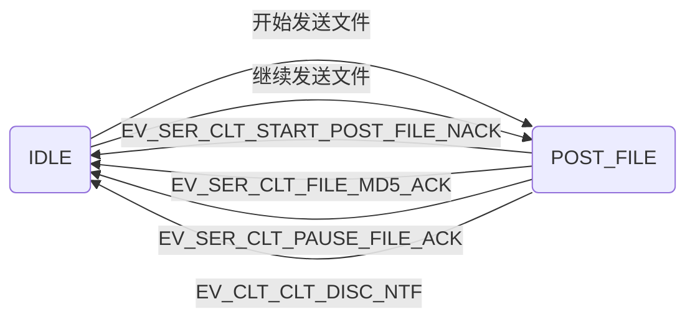

## 文件状态图
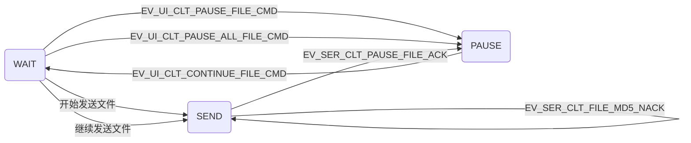

## 多文件上传
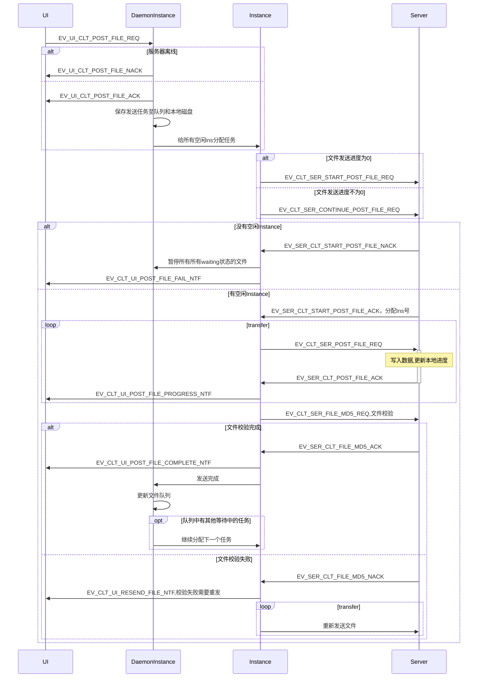
* 客户端设置5个普通Instance，每次最多可同时发送5个文件
* 客户端DaemonIns收到UI端发送请求后，会保存文件信息至队列中，初始化文件状态，然后给所有空闲Ins各分配一个文件进行传输
* 客户端Ins发送传输文件请求后，服务端分配空闲Instance并返回Instance号，否则拒绝传输
* 消息定义
```C++
#define EV_UI_CLT_POST_FILE_REQ                  (u16)22      // UI请求开始发送文件
typedef struct {
	u16 fileNum;                    // 文件数量
	u32 fileNo;                     // 文件编号
	s8 fileName[BUFFER_SIZE];       // 文件名
}ui_clt_post_file_req;
#define EV_UI_CLT_POST_FILE_ACK                  (u16)23      // 底层确认发送文件
#define EV_UI_CLT_POST_FILE_NACK                 (u16)24      // 底层拒绝发送文件

#define EV_CLT_UI_POST_FILE_PROGRESS_NTF         (u16)25      // 底层通知UI文件进度
typedef struct {
	u32 fileNo;                     // 文件编号
	u32 progress;                   // 文件进度
}ui_clt_post_file_progress_ntf;
#define EV_CLT_UI_POST_FILE_FAIL_NTF             (u16)22      // 底层通知UI服务端资源不足

#define EV_CLT_UI_RESEND_FILE_NTF                (u16)23      // 底层通知UI校验失败，重新发送文件
typedef struct {
	u32 fileNo;                     // 文件编号
}clt_ui_file_md5_ntf;
#define EV_CLT_UI_POST_FILE_COMPLETE_NTF         (u16)23      // 底层通知UI文件发送成功

#define EV_CLT_SER_START_POST_FILE_REQ           (u16)1       // 客户端请求发送文件
typedef struct {
	char fileName[BUFFER_SIZE];     // 文件名
}clt_ser_post_file_req;
#define EV_SER_CLT_START_POST_FILE_ACK           (u16)2       // 服务端确认开始接收文件
typedef struct {
	u8 InstanceNo;                  // 分配的Instance号
}ser_clt_post_file_ack;
#define EV_SER_CLT_START_POST_FILE_NACK          (u16)3       // 服务端资源不足

#define EV_CLT_SER_POST_FILE_REQ                 (u16)4       // 客户端发送文件给服务端
typedef struct {
	s8 fileName[BUFFER_SIZE];       // 文件内容
}clt_ser_post_file_ntf;
#define EV_SER_CLT_POST_FILE_ACK                 (u16)5       // 服务端确认接收文件数据

#define EV_CLT_SER_FILE_MD5_REQ                  (u16)6       // 客户端文件传输完毕，发送md5校验码
typedef struct {
	s8 md5[32];                     // 文件md5校验码
}clt_ser_file_end_ntf;

#define EV_SER_CLT_FILE_MD5_ACK                  (u16)7       // 服务端文件校验完成
#define EV_SER_CLT_FILE_MD5_NACK                 (u16)8       // 服务端文件校验失败
```

## 发送过程中添加新文件
### 时序图
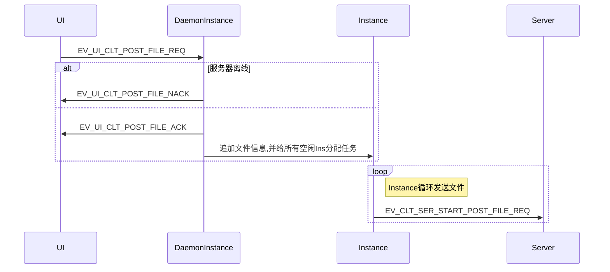

## 暂停发送
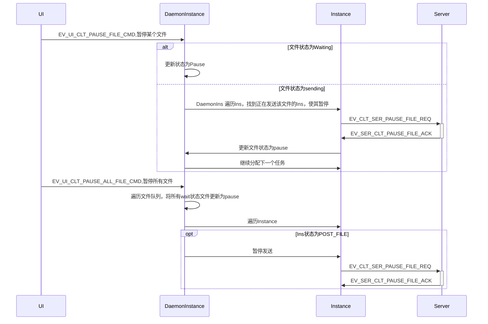
* 消息定义
```C++
#define EV_UI_CLT_PAUSE_FILE_CMD                 (u16)24      // UI通知底层暂停发送
typedef struct {
	u16 fileNo;
}ui_clt_pause_file_cmd;
#define EV_UI_CLT_PAUSE_ALL_FILE_CMD             (u16)25      // UI通知底层全部暂停

#define EV_CLT_SER_PAUSE_FILE_REQ                (u16)9       // 客户端请求暂停
#define EV_SER_CLT_PAUSE_FILE_ACK                (u16)10      // 服务端确认暂停
```

## 继续发送
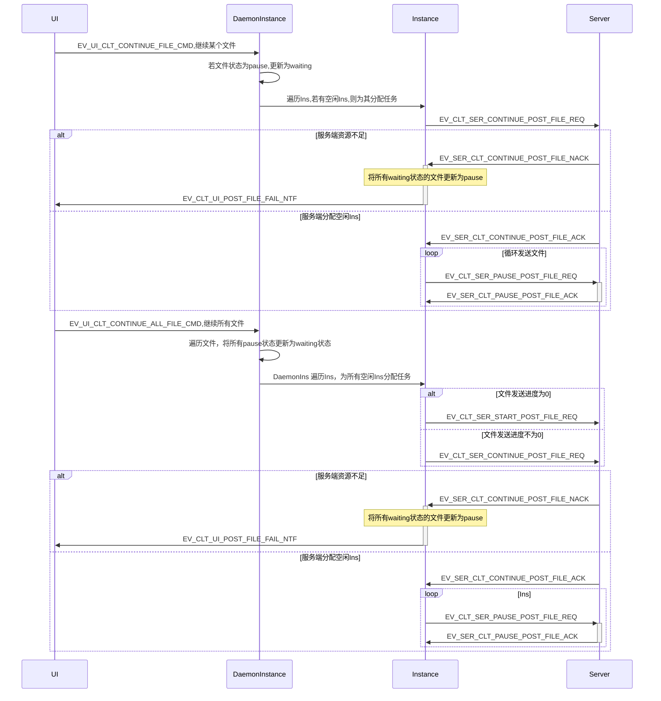
* 消息定义
```C++
#define EV_UI_CLT_CONTINUE_FILE_CMD              (u16)26      // UI通知底层继续发送
typedef struct {
	u16 fileNo;
}ui_clt_pause_file_cmd;
#define EV_UI_CLT_CONTINUE_ALL_FILE_CMD          (u16)27      // UI通知底层全部继续
#define EV_CLT_SER_CONTINUE_POST_FILE_REQ        (u16)11      // 客户端请求继续发送文件
typedef struct {
	char fileName[FILE_BUF_SIZE];   // 文件名
}clt_ser_continue_post_file_req;
#define EV_SER_CLT_CONTINUE_POST_FILE_ACK        (u16)12      // 服务端确认继续发送文件
typedef struct {
	u8 InstanceNo;                  // 分配的Instance号
	u32 progress;                   // 文件进度
}ser_clt_continue_post_file_ack;
#define EV_SER_CLT_CONTINUE_POST_FILE_NACK       (u16)13      // 服务端拒绝继续发送
```

## 取消发送
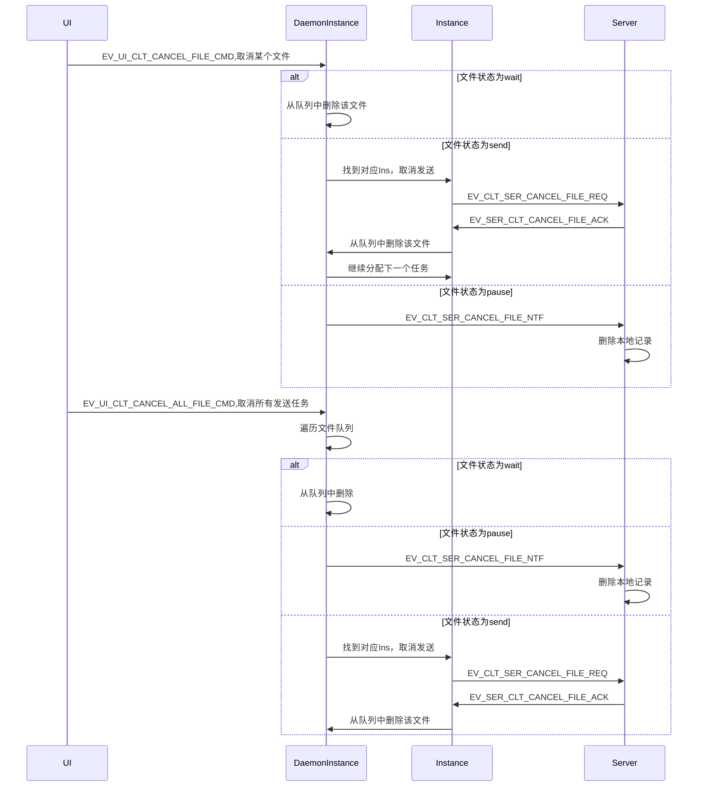
* 消息体
```C++
#define EV_UI_CLT_CANCEL_FILE_CMD                (u16)28      // UI通知底层取消发送
typedef struct {
	u16 fileNo;                     // 文件编号
}ui_clt_pause_file_cmd;
#define EV_UI_CLT_CANCEL_ALL_FILE_CMD            (u16)29      // UI通知底层全部取消

#define EV_CLT_SER_CANCEL_FILE_REQ               (u16)14      // 客户端请求取消发送
#define EV_SER_CLT_CANCEL_FILE_ACK               (u16)15      // 服务端确认取消发送
#define EV_CLT_SER_CANCEL_FILE_NTF               (u16)16      // 客户端通知取消发送暂停中的文件
typedef struct{
	char fileName[BUFFER_SIZE];     // 文件名
}clt_ser_calcel_file_ntf;
```

## 断点续传

### 传输过程中客户端和服务端断链
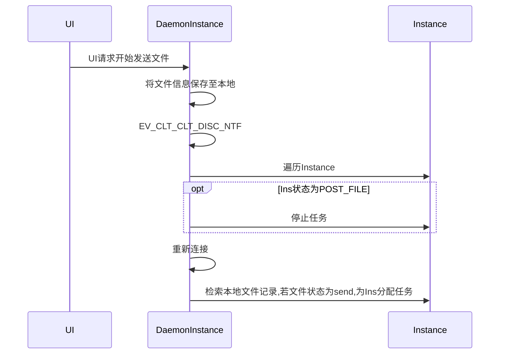
* 底层收到文件发送请求后会在本地保存文件信息，包括文件名，文件编号，发送进度，文件大小，文件状态
* 客户端在每次收到服务端文件进度确认消息后，会记录文件进度到本地
* 断链后，Instance直接停止发送任务，无需其他确认步骤
* 恢复连接后，DaemonInstance会收到重连消息，然后检索本地记录，给send状态的文件分配Ins继续发送

### 客户端崩溃重启
#### 时序图
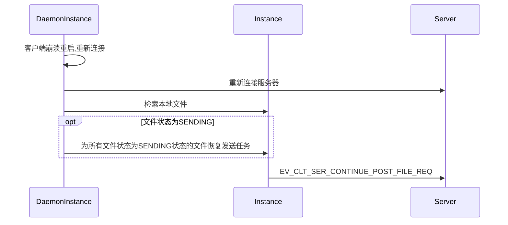
* 底层收到文件发送请求后会在本地保存文件信息，包括文件名，文件编号，发送进度，文件大小，文件状态
* 客户端在每次收到服务端文件进度确认消息后，会记录文件进度到本地
* 客户端重新连接服务端后，会检索本地文件，若有文件状态为发送中，并为其恢复任务

### 服务端崩溃重启
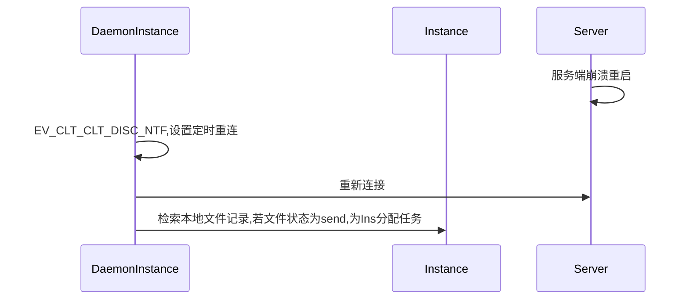

## 在线客户端列表
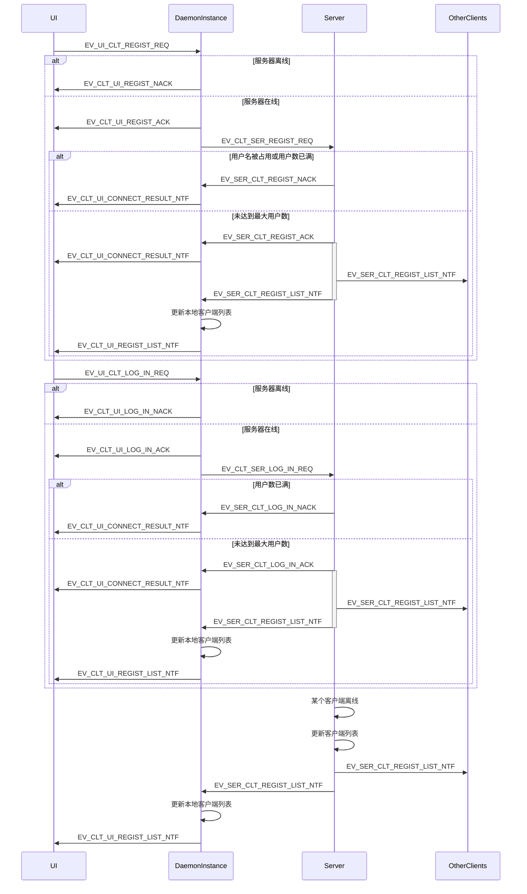
* 客户端建立连接后会发送注册请求
* 消息定义
```C++
enum CONNECT_RESULT {              // 连接结果
    CONNECTION_SUCCEED,
    CLIENT_NUMBER_LIMIT,
    OCCUPIED_USERNAME
};
#define EV_UI_CLT_REGIST_REQ                     (u16)39      // UI通知底层注册用户名
typedef struct {
	s8 userName[BUFFER_SIZE];       // 用户名
}ui_clt_regist_cmd;
#define EV_CLT_UI_REGIST_ACK                     (u16)40      // 底层确认注册
#define EV_CLT_UI_REGIST_NACK                    (u16)41      // 底层拒绝注册

#define EV_UI_CLT_LOG_IN_REQ                     (u16)42      // UI通知底层登录
typedef struct {
    s8 userName[BUFFER_SIZE];       // 用户名
}ui_clt_log_in_cmd;
#define EV_CLT_UI_LOG_IN_ACK                     (u16)43      // 底层确认登录
#define EV_CLT_UI_LOG_IN_NACK                    (u16)44      // 底层拒绝登录

#define EV_CLT_UI_CONNECT_RESULT_NTF             (u16)45      // 底层通知UI连接结果
typedef struct {
    CONNECT_RESULT result;     // 连接结果
}clt_ui_connect_result_ntf;
#define EV_CLT_UI_REGIST_LIST_NTF                (u16)46      // 底层通知UI在线列表
typedef struct {
    s32 clientNum;                  // 客户端数量
    u32 clientNode[100];            // 客户端编号
    s8 clientName[BUFFER_SIZE];     // 客户端用户名
}clt_ui_regist_list_ntf;

#define EV_CLT_SER_REGIST_REQ                    (u16)17      // 客户端发送注册请求
typedef struct {
	s8 userName[BUFFER_SIZE];      // 用户名
}clt_ser_regist_req;
#define EV_SER_CLT_REGIST_ACK                    (u16)18      // 服务端确认注册
#define EV_SER_CLT_REGIST_NACK                   (u16)19      // 服务端拒绝注册

#define EV_CLT_SER_LOG_IN_REQ                    (u16)20      // 客户端发送登录请求
typedef struct {
    s8 userName[BUFFER_SIZE];      // 用户名
}clt_ser_regist_req;
#define EV_SER_CLT_LOG_IN_ACK                    (u16)21      // 服务端确认登录
#define EV_SER_CLT_LOG_IN_NACK                   (u16)22      // 服务端拒绝登录

#define EV_SER_CLT_REGIST_LIST_NTF               (u16)23      // 服务端通知客户端在线列表
typedef struct {
	s32 clientNum;                  // 客户端数量
	u32 clientNo[100];              // 客户端编号
	s8 clientName[BUFFER_SIZE];     // 客户端用户名
}ser_clt_regist_list_ntf;
```

## 一对多消息发送
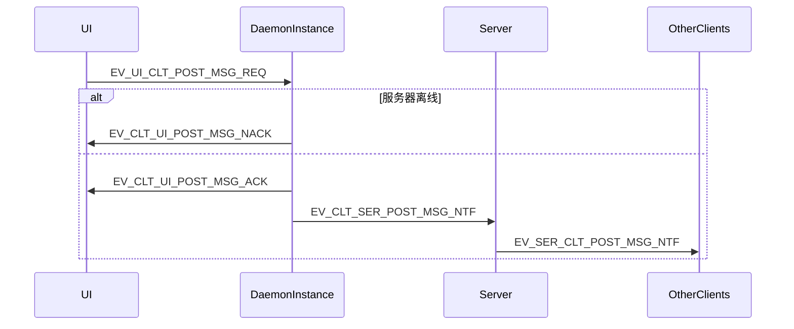
* 客户端发送消息,全部使用服务端中转的方式
* 客户端可以一次性给最多16个客户端发送消息（包括离线消息）
* 消息体
```C++
#define EV_UI_CLT_POST_MSG_REQ                   (u16)35      // UI请求发送消息
typedef struct {
	u16 fileNo;
}ui_clt_post_msg_req;
#define EV_CLT_UI_POST_MSG_ACK                   (u16)36      // 底层确认发送消息
#define EV_CLT_UI_POST_MSG_NACK                  (u16)37      // 底层拒绝发送消息

#define EV_CLT_SER_POST_MSG_NTF                  (u16)21      // 客户端通知服务端发送消息
typedef struct {
	u8 clientNum;                   // 目标客户端数量
	u32 clientAppID[16];            // 目标客户端节点号
	s8 msgContent[BUFFER_SIZE];     // 消息内容
}clt_ser_post_msg_ntf;

#define EV_SER_CLT_POST_MSG_NTF                  (u16)22      // 服务端向客户端发送消息
typedef struct {
	u32 srcClientNo;                // 源客户端编号
	s8 msgContent[BUFFER_SIZE];     // 消息内容
}ser_clt_post_msg_ntf;
```