# OspDemo 概要设计 Server
--------

[TOC]

## 需求

* 实现客户端文件上传功能
* 支持客户端同时上传多个文件(最多同时上传5个文件)
* 支持文件发送过程中添加新任务或取消发送中的任务
* 支持断点续传(客户端程序崩溃重启, 客户端和服务端断链,服务端崩溃重启)
* 上传文件完整性验证
* 支持客户端之间的消息转发(最多16个客户端)
* 支持离线消息发送
* 支持在线客户端列表的获取和实时刷新(最多支持100个客户端同时在线)

## 设计原则
* 服务端使用两套App，FileApp和MsgApp，FileApp用于处理文件发送任务，MsgApp用于处理消息收发，更新在线客户端列表

## Instance状态定义
```C++
#define INSTANCE_STATUS_IDLE             u32(0)    // 空闲
#define INSTANCE_STATUS_RECEIVE_FILE     u32(1)    // 接收文件
#define INSTANCE_STATUS_RECEIVE_MSG      u32(2)    // 接收消息
```

## Instance状态图
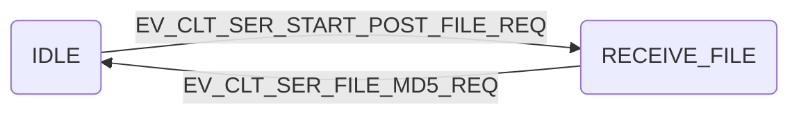

## 多文件上传
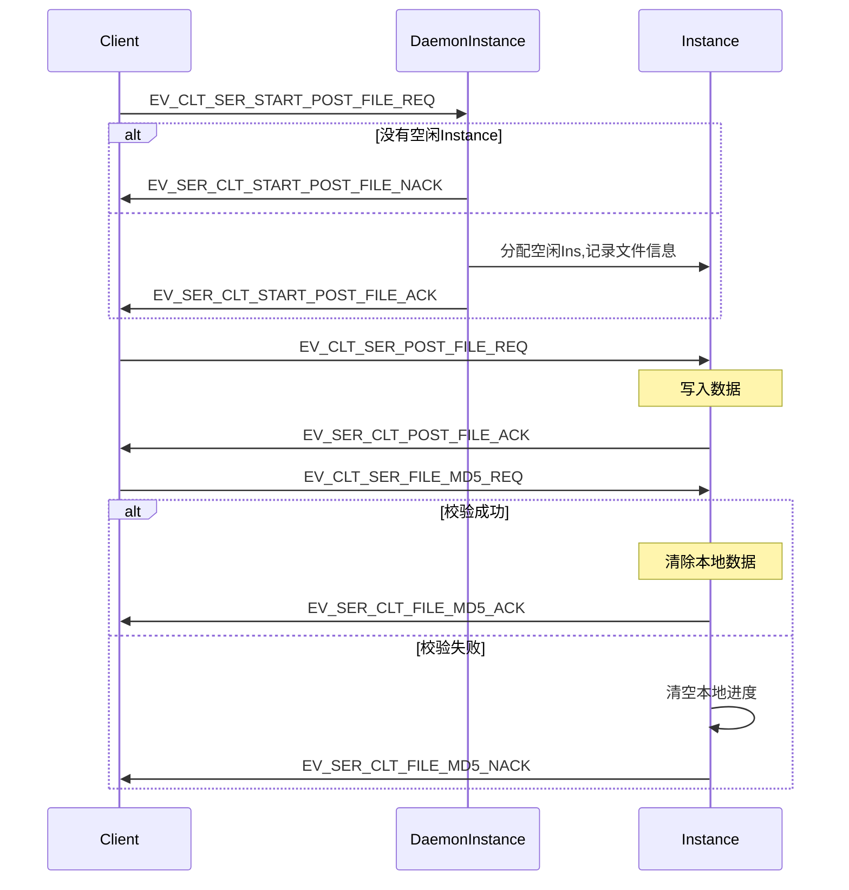
* 服务端设置200个普通Instance，每次可以同时处理200个文件发送任务
* 服务端DaemonIns收到文件发送请求后，会保存发送端信息，文件信息
* 消息定义
```C++
#define EV_CLT_SER_START_POST_FILE_REQ           (u16)1       // 客户端请求发送文件
typedef struct {
	char fileName[BUFFER_SIZE];     // 文件名
}clt_ser_post_file_req;
#define EV_SER_CLT_START_POST_FILE_ACK           (u16)2       // 服务端确认开始接收文件
typedef struct {
	u8 InstanceNo;                  // 分配的Instance号
}ser_clt_post_file_ack;
#define EV_SER_CLT_START_POST_FILE_NACK          (u16)3       // 服务端资源不足

#define EV_CLT_SER_POST_FILE_REQ                 (u16)4       // 客户端发送文件给服务端
typedef struct {
	s8 fileName[BUFFER_SIZE];       // 文件内容
}clt_ser_post_file_ntf;
#define EV_SER_CLT_POST_FILE_ACK                 (u16)5       // 服务端确认接收文件数据

#define EV_CLT_SER_FILE_MD5_REQ                  (u16)6       // 客户端文件传输完毕，发送md5校验码
typedef struct {
	s8 md5[32];                     // 文件md5校验码
}clt_ser_file_end_ntf;

#define EV_SER_CLT_FILE_MD5_ACK                  (u16)7       // 服务端文件校验完成
#define EV_SER_CLT_FILE_MD5_NACK                 (u16)8       // 服务端文件校验失败
```

## 暂停发送
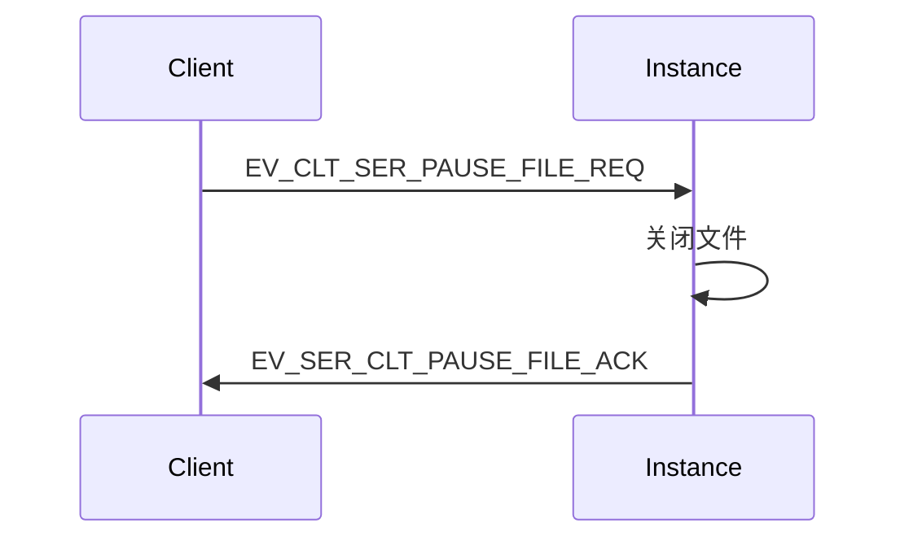
* 消息定义
```C++
#define EV_CLT_SER_PAUSE_FILE_REQ                (u16)9       // 客户端请求暂停
#define EV_SER_CLT_PAUSE_FILE_ACK                (u16)10      // 服务端确认暂停
```

## 继续发送
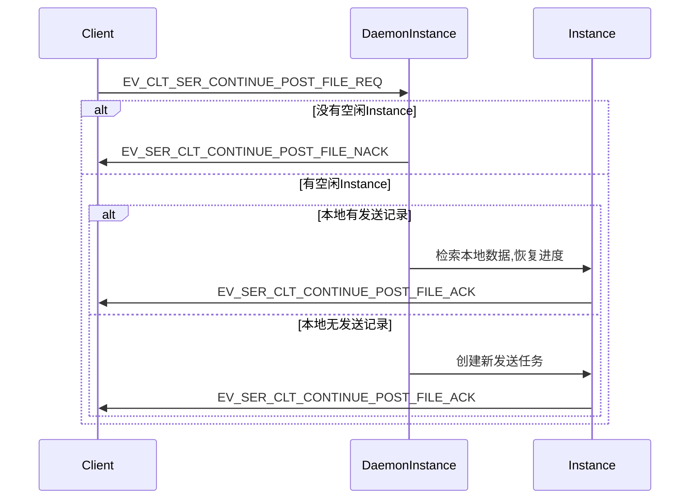
* 消息定义
```C++
#define EV_CLT_SER_CONTINUE_POST_FILE_REQ        (u16)11      // 客户端请求继续发送文件
typedef struct {
	char fileName[FILE_BUF_SIZE];   // 文件名
}clt_ser_continue_post_file_req;
#define EV_SER_CLT_CONTINUE_POST_FILE_ACK        (u16)12      // 服务端确认继续发送文件
typedef struct {
	u8 InstanceNo;                  // 分配的Instance号
	u32 progress;                   // 文件进度
}ser_clt_continue_post_file_ack;
#define EV_SER_CLT_CONTINUE_POST_FILE_NACK       (u16)13      // 服务端拒绝继续发送
```

## 取消发送
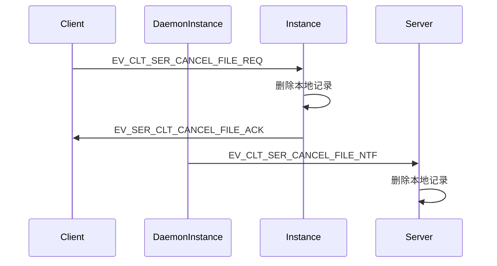
* 消息体
```C++
#define EV_CLT_SER_CANCEL_FILE_REQ               (u16)14      // 客户端请求取消发送
#define EV_SER_CLT_CANCEL_FILE_ACK               (u16)15      // 服务端确认取消发送
#define EV_CLT_SER_CANCEL_FILE_NTF               (u16)16      // 客户端通知取消发送暂停中的文件
typedef struct{
	char fileName[BUFFER_SIZE];     // 文件名
}clt_ser_calcel_file_ntf;
```


## 断点续传

### 传输过程中客户端和服务端断链
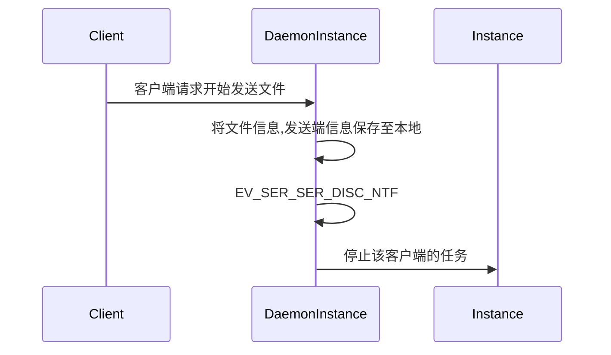
* 服务端收到文件发送请求后会在本地保存文件信息和发送端信息，包括文件名，发送进度，文件大小，发送端用户名和分配的Instance编号
* 服务端在每次收到文件数据后，会将文件进度记录到本地
* 某个文件发送完毕后，服务端会清除本地发送记录
* 断链后，DaemonInstance通知Instance直接停止接收任务，无需其他确认步骤

### 客户端崩溃重启
#### 时序图
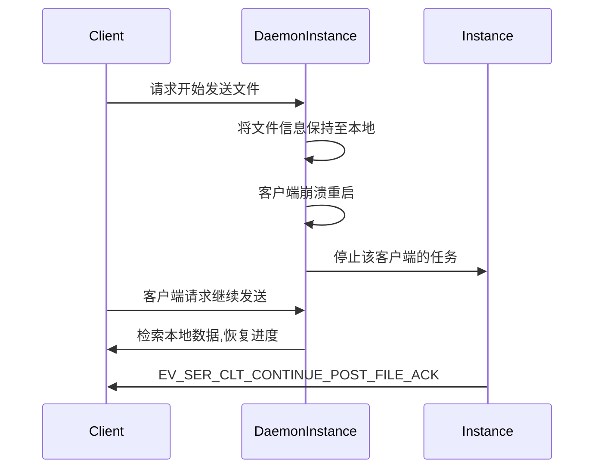
* 服务端收到文件发送请求后会在本地保存文件信息和发送端信息，包括文件名，发送进度，文件大小，发送端用户名节点号和分配的Instance编号
* 服务端在每次收到文件数据后，会将文件进度记录到本地
* 某个文件发送完毕后，服务端会清除本地发送记录

### 服务端崩溃重启
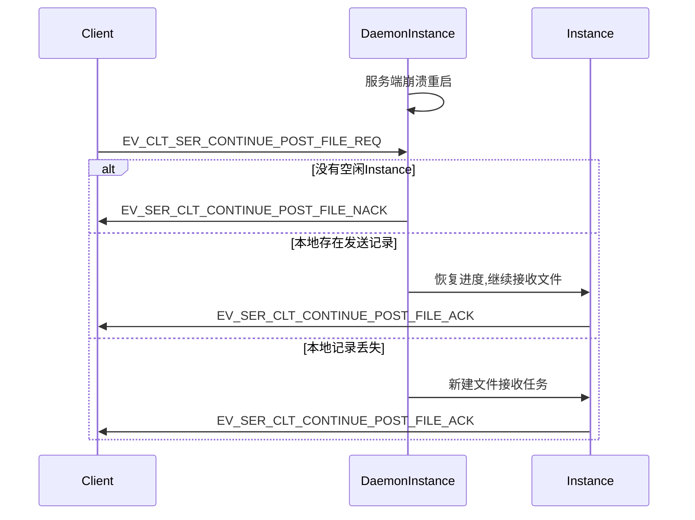

## 在线客户端列表
### Instance状态图
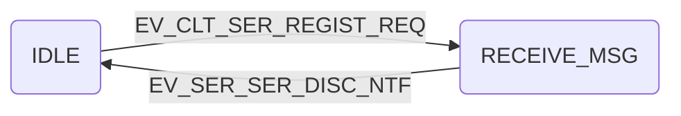

### 时序图
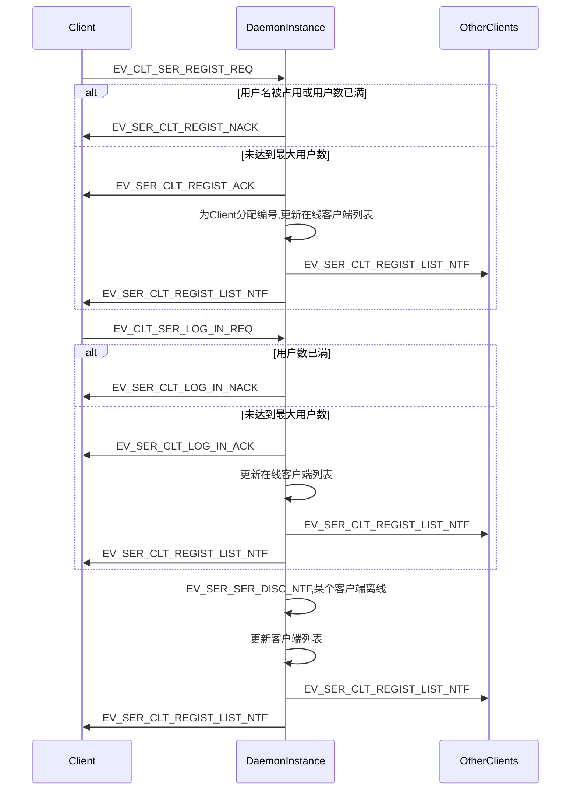
* 客户端建立连接后会发送注册请求
* 服务端收到请求后，会检索本地文件，查看该客户端是否注册过，若没有注册过，会为其分配编号
* 消息定义
```C++
#define EV_CLT_SER_REGIST_REQ                    (u16)17      // 客户端发送注册请求
typedef struct {
	s8 userName[BUFFER_SIZE];      // 用户名
}clt_ser_regist_req;
#define EV_SER_CLT_REGIST_ACK                    (u16)18      // 服务端确认注册
#define EV_SER_CLT_REGIST_NACK                   (u16)19      // 服务端拒绝注册

#define EV_CLT_SER_LOG_IN_REQ                    (u16)20      // 客户端发送登录请求
typedef struct {
    s8 userName[BUFFER_SIZE];      // 用户名
}clt_ser_regist_req;
#define EV_SER_CLT_LOG_IN_ACK                    (u16)21      // 服务端确认登录
#define EV_SER_CLT_LOG_IN_NACK                   (u16)22      // 服务端拒绝登录

#define EV_SER_CLT_REGIST_LIST_NTF               (u16)23      // 服务端通知客户端在线列表
typedef struct {
	s32 clientNum;                  // 客户端数量
	u32 clientNo[100];              // 客户端编号
	s8 clientName[BUFFER_SIZE];     // 客户端用户名
}ser_clt_regist_list_ntf;
```

## 一对多消息发送
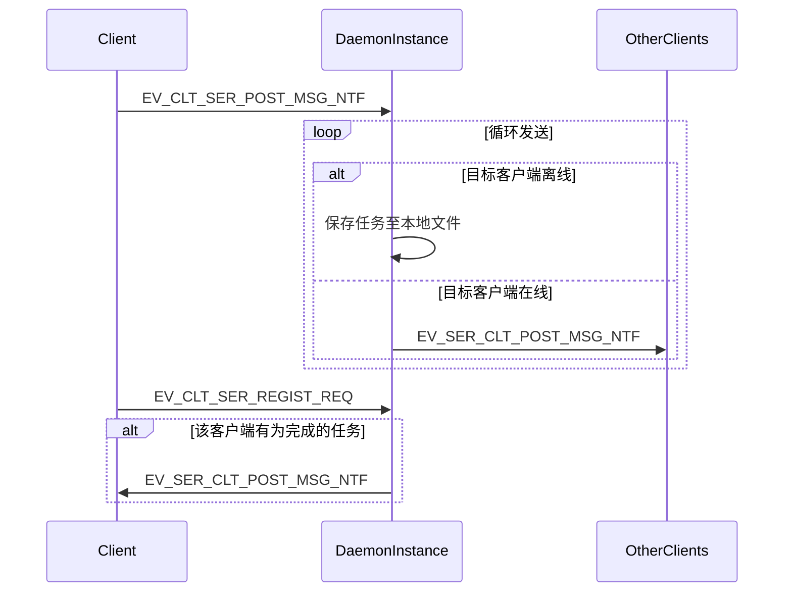
* 客户端发送消息,全部使用服务端中转的方式
* 客户端可以一次性给最多16个客户端发送消息（包括离线消息）
* 客户端注册时，服务端会检索本地文件，若该客户端有未完成的任务，则依次发送
* 消息体
```C++
#define EV_CLT_SER_POST_MSG_NTF                  (u16)21      // 客户端通知服务端发送消息
typedef struct {
	u8 clientNum;                   // 目标客户端数量
	u32 clientAppID[16];            // 目标客户端节点号
	s8 msgContent[BUFFER_SIZE];     // 消息内容
}clt_ser_post_msg_ntf;

#define EV_SER_CLT_POST_MSG_NTF                  (u16)22      // 服务端向客户端发送消息
typedef struct {
	u32 srcClientNo;                // 源客户端编号
	s8 msgContent[BUFFER_SIZE];     // 消息内容
}ser_clt_post_msg_ntf;
```
