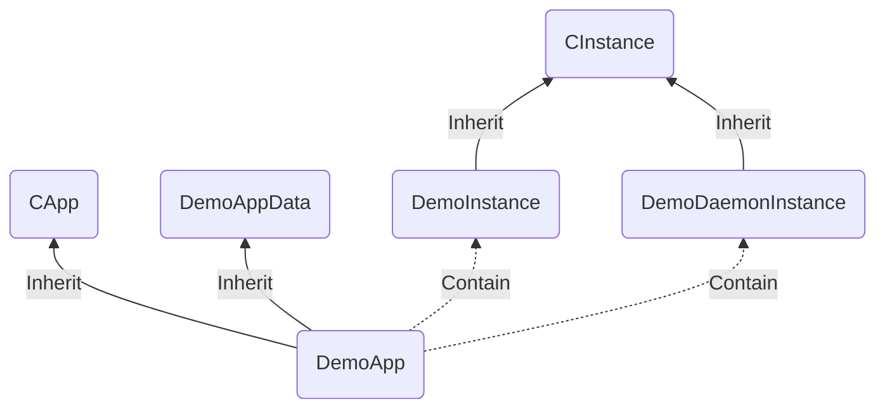
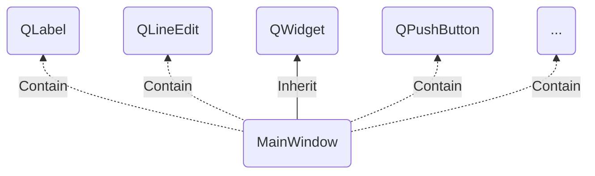
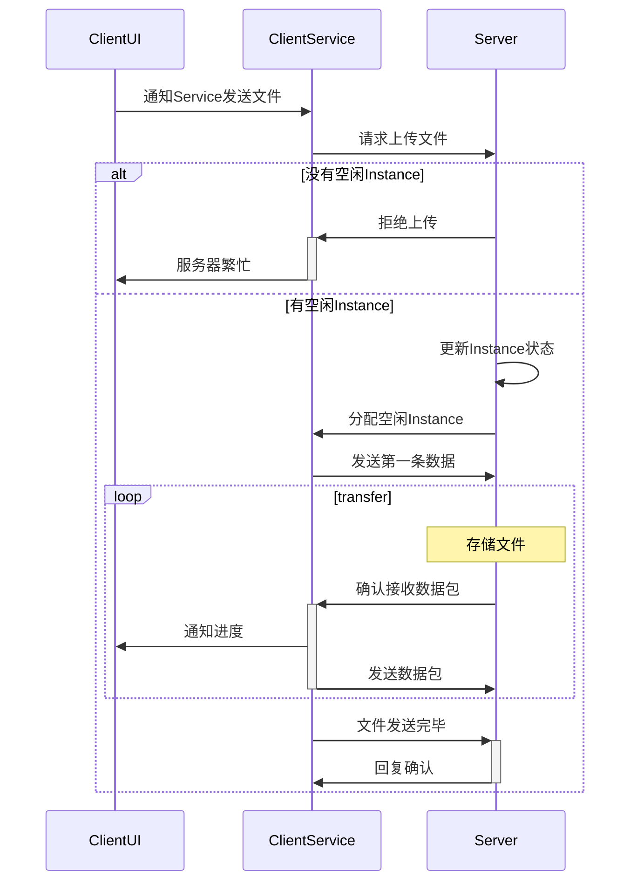
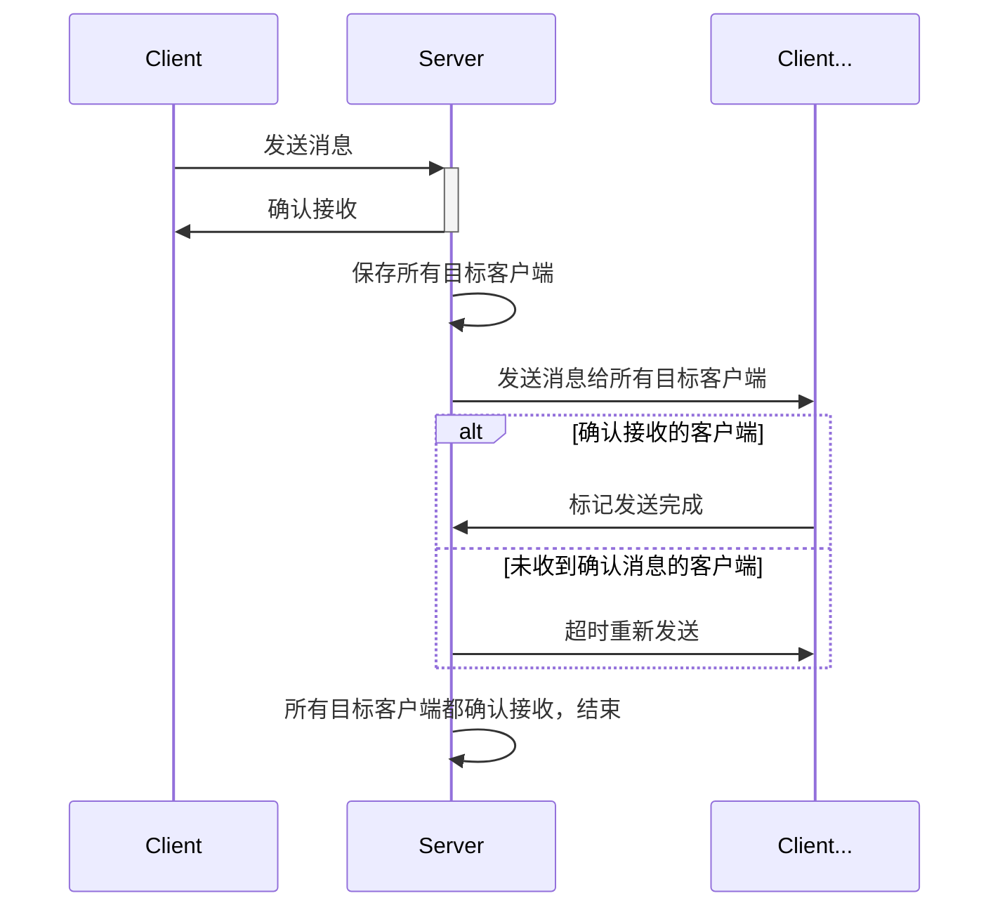
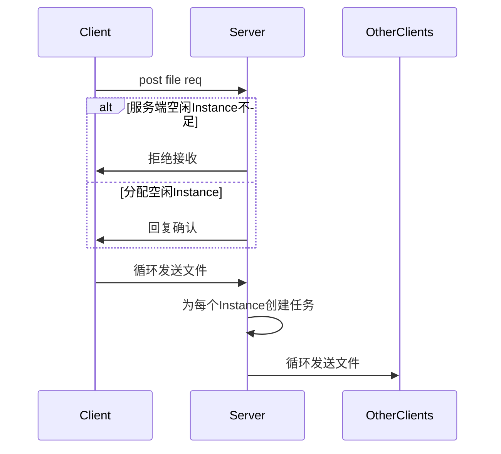
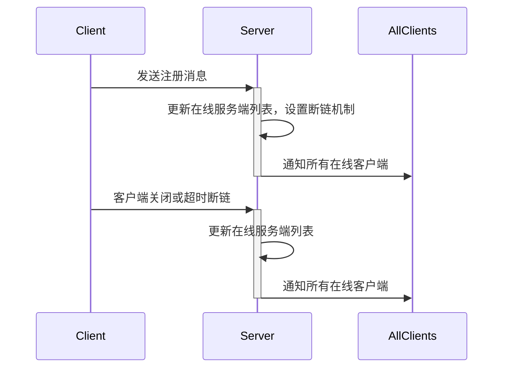
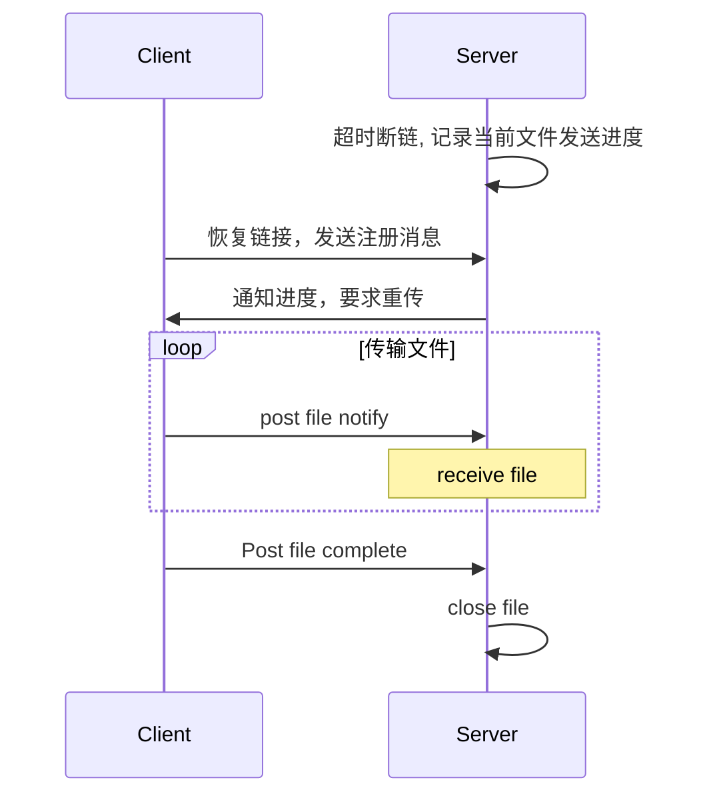
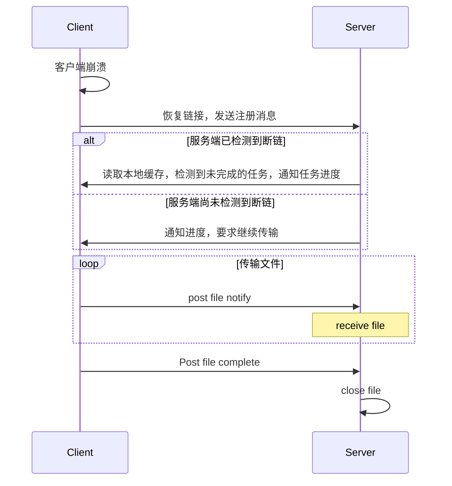
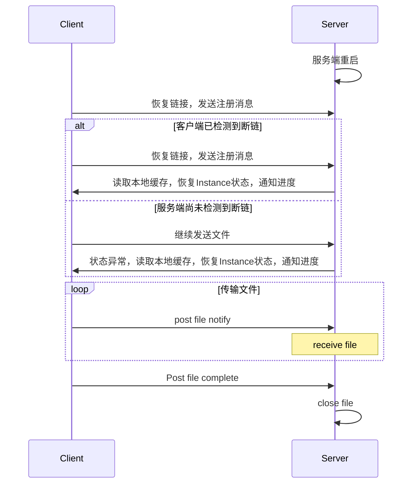

# OspDemo 概要设计
--------


[TOC]

## 需求

* 实现客户端文件上传功能
* 支持客户端同时上传多个文件
* 支持断点续传(客户端程序崩溃重启, 客户端和服务端断链,服务端崩溃重启)
* 上传文件完整性验证
* 定义统一的消息体，可以支持文件和短消息传输
* 支持在线客户端列表的获取和实时刷新
* 支持客户端之间的消息转发
* 支持一到多的客户端消息聊天、文件传输

## 相关文档
* 《C++编程规范V1.5.pdf》
* 《科达工程创建规范.pdf》
* 《OSP 用户手册_v1.8.pdf》

## 设计原则
* 事件驱动、跨平台、面向对象、模块化设计

## 体系架构
### Service

### UI

### Instance状态
```C++
#define INSTANCE_STATUS_IDLE             u32(0)    // 空闲
#define INSTANCE_STATUS_POST_FILE        u32(1)    // 发送文件
#define INSTANCE_STATUS_RECEIVE_FILE     u32(2)    // 接收文件
#define INSTANCE_STATUS_WAIT_FILE        u32(3)    // 一对多文件传输时，其他Instance等待文件上传完毕
#define INSTANCE_STATUS_POST_MESSAGE     u32(4)    // 发送Message
```

## 时序图
### UI端与Service数据交互
```mermaid
sequenceDiagram
    participant Service
    participant UI
    UI ->> Service: OspPost向本地发送数据
    UI ->> + Service: 设置回调函数
    Service ->> UI:调用函数，在回调函数中emit signal
    deactivate SignalInstance
```
* UI侧通过OspPost接口发送消息给Service
* Service向UI发送数据，需要UI侧先设置回调函数，Service侧调用函数，并在函数内emit signal


### 文件上传

* 客户端每次最多可同时发送5个文件
* UI侧通知Service开始传输文件
* Service侧发送request到Server
* Server根据实际情况选择分配空闲的Instance或拒绝文件上传
* Service侧获得Instance号开始循环发送数据包
* 服务端对每一条消息都要验证进度，并回复当前已记录的文件进度
* 客户端发送的每一条消息，都需要服务端确认后才会继续发送下一条，否则等待，直至超时重传
* 客户端文件发送完毕，服务端回复确认
* 消息体结构：
``` C++
typedef struct MsgSendFileReq {
	 u8 msgType;      // 消息类型
	 u8 num;          // 文件数量
	 s8 buf[];        // 文件名，以'\0'分隔
}MsgSendFileReq;

typedef struct MsgSendFile {
	 u8 msgType;      // 消息类型
	 u8 num;          // 当前文件编号
	 s32 progress;    // 文件进度
	 s8 buf[];        // 文件内容
}MsgSendFile;

typedef struct MsgFileConfirm {
	 u8 msgType;      // 消息类型
	 u8 num;          // 当前文件编号
	 s32 progress;    // 确认收到的文件进度
}MsgFileConfirm;
```
### 一对多消息发送

* 客户端一次最多给另外8个客户端发送消息
* 客户端或服务器发送的每一条消息都要确认回复，否则超时重传
* 消息体结构：
``` C++
typedef struct MsgMessage {
	 u8 msgType;        // 消息类型:短消息传输
	 u8 num;            // 目标客户端数量
	 u16 clientNum[8];  // 目标APPID
	 s8 buf[];          // 消息内容
}MsgMessage;
```

### 一对多文件发送

* 一对多的文件发送方式全部采用服务器中转的发送方式，且每次只支持发送一个文件
* 可以最多指定8个目标客户端
* 客户端请求发送文件后，服务端为每个目标客户端分配一个Instance，如果资源不足，将拒绝发送请求
* 服务端收到文件后，为每个Instance创建任务并向目标客户端发送文件
* 消息体结构：
``` C++
typedef struct MsgSendFileMultiClientReq {
	 u8 msgType;        // 消息类型:多客户端文件传输
	 u8 num;            // 目标客户端数量
	 u16 clientNum[8];  // 目标客户端APPID
	 s8 buf[];          // 文件名
}MsgSendFileMultiClientReq;
```

### 在线客户端列表的获取和实时刷新

* 服务端或服务器发送的每一条消息都要确认回复，否则超时重传
* 消息体结构：
``` C++
typedef struct MsgClientRegist {
	 u8 msgType;        // 消息类型:在线客户端注册
	 u8 num;            // 在线客户端数量
	 s8 buf[];          // 客户端用户名
}MsgClientRegist;
```

## 异常处理
### 超时断开链接

* 服务端超时断开链接，记录下文件传输进度
* 客户端重新连接，发送注册消息
* 服务端检索本地是否有未完成的任务，若有则回复文件传输进度
* 客户端继续发送文件
* 消息体结构：
``` C++
typedef struct MsgSendFileReconnect {
	 u8 msgType;      // 消息类型：断链重连继续发送文件
	 u8 num;          // 文件数量
	 s32 buf[];       // 文件进度
}MsgSendFileReconnect;

typedef struct MsgSendFile {
	 u8 msgType;      // 消息类型
	 u8 num;          // 当前文件编号
	 s32 progress;    // 文件进度
	 s8 buf[];        // 文件内容
}MsgSendFile;
```

### Client异常崩溃重启

* 客户端在发送文件前，会保存文件路径和文件编号信息
* 客户端崩溃重启，发送客户端注册请求
* 服务端收到请求，回复文件传输进度
* 客户端继续发送文件

### Server异常崩溃

* 客户端在发送文件前，会保存文件路径和文件编号信息
* 服务端每次收到文件后，会保存文件进度，客户端编号，当前状态，当前任务等信息
* 客户端检测到断链后，会不断尝试连接
* 客户端连接成功，服务端搜索该客户端是否有未完成的任务，若有则继续
* 若客户端未检测到断链，继续文件传输，服务端会检测到Instance状态异常，会读取本地缓存，恢复Instance状态


