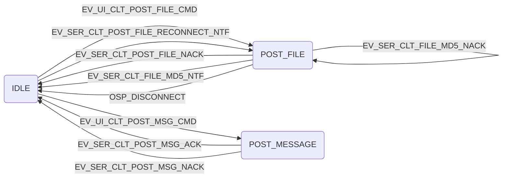
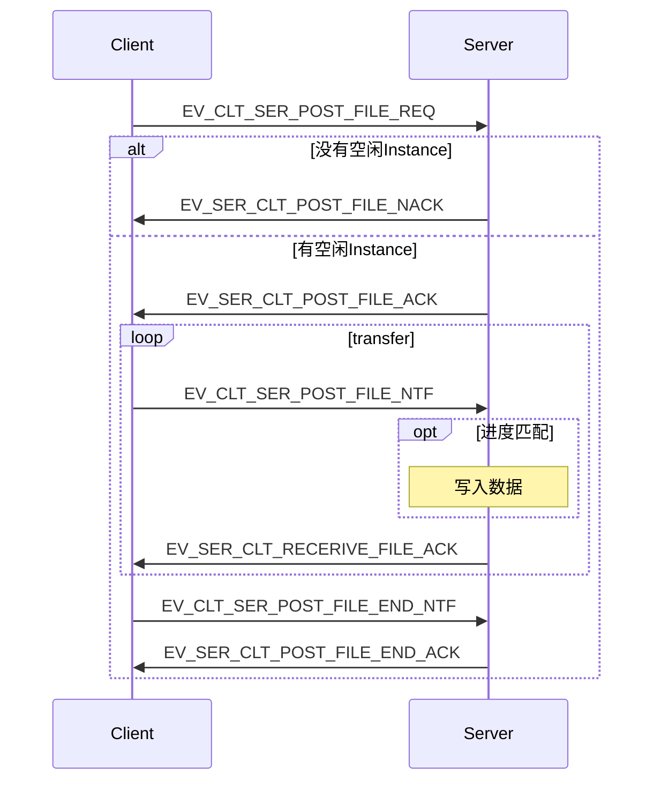
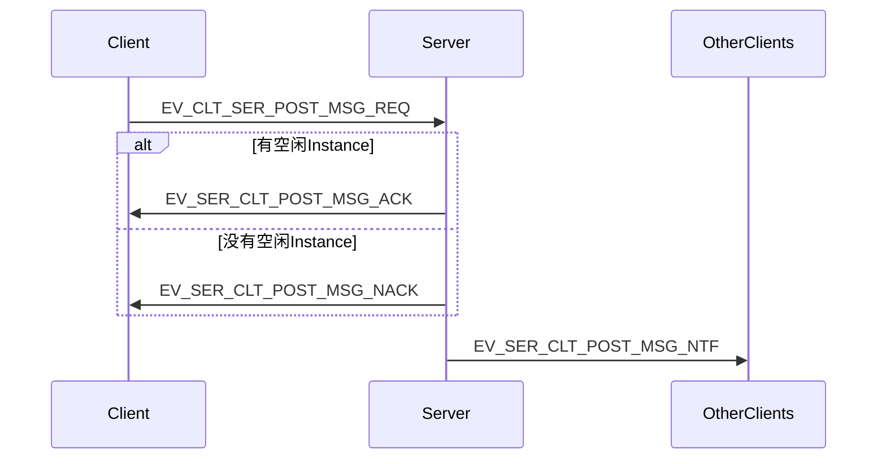
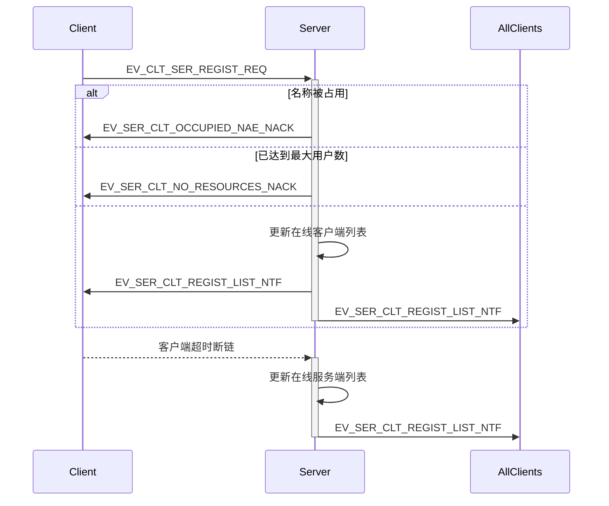
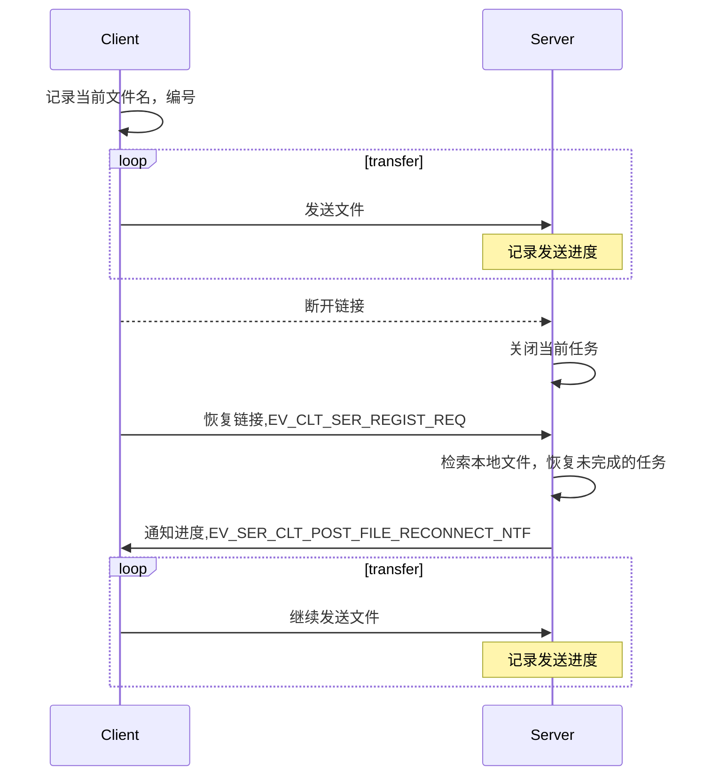
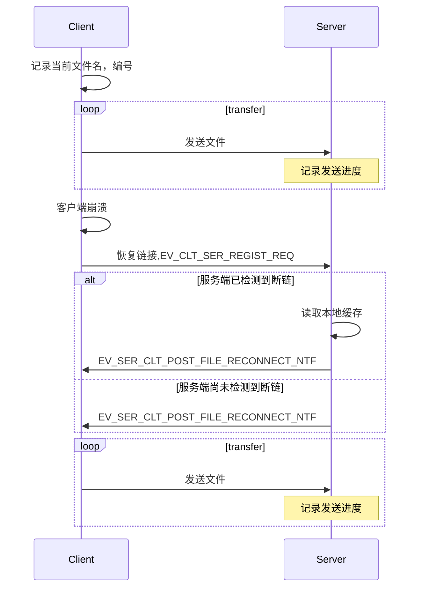
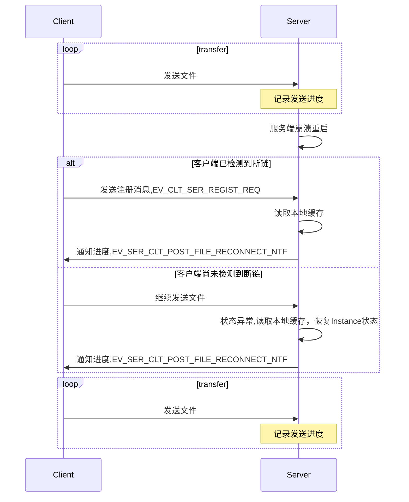

# OspDemo 概要设计 Client
--------

[TOC]

## 需求

* 实现客户端文件上传功能
* 支持客户端同时上传多个文件(最多同时上传5个文件)
* 支持断点续传(客户端程序崩溃重启, 客户端和服务端断链,服务端崩溃重启)
* 上传文件完整性验证
* 定义统一的消息体，可以支持文件和短消息传输
* 支持在线客户端列表的获取和实时刷新(最多支持100个客户端同时在线)
* 支持客户端之间的消息转发(最多16个客户端)

## 设计原则
* 模块化设计、底层作为开发库供UI层调用
* 为避免服务端在同时处理多个任务时消息队列溢出导致数据丢失，客户端发送的每一条消息都需要服务端确认，否则超时重传

## 接口定义
* UI向底层发送数据使用OspPost接口
* 底层向UI发送数据使用回调函数实现
```C++
typedef void (*CallBack)(u8 eventType, const void* content);
class DemoAppData {
public:
	void setCallBack(CallBack pFunc)
	{
		m_callBack = pFunc;
	}
	CallBack getCallBackSendProgress()
	{
		return m_callBack;
	}
private:
	CallBack m_callBack;
}
```
* 消息体
```C++
#define EV_UI_CLT_POST_FILE_CMD            (u16)18      // UI通知底层开始发送文件
typedef struct {
	u8 fileNum;                     // 文件数量
	s8 fileName[FILE_BUF_SIZE];     // 文件名
}ui_clt_post_file_cmd;

#define EV_UI_CLT_POST_MSG_CMD             (u16)19      // UI通知底层开始发送消息
typedef struct {
	u8 clientNum;                   // 目标客户端数量
	u16 clientAppID[16];            // 目标客户端AppID
	s8 msgContent[FILE_BUF_SIZE];   // 消息内容
}ui_clt_post_msg_cmd;

#define EV_CLT_UI_POST_FILE_NACK           (u16)20      // 底层通知UI服务器繁忙，拒绝发送文件

#define EV_CLT_UI_POST_FILE_PROGRESS_NTF   (u16)21      // 底层通知UI文件发送进度
typedef struct {
	u8 fileNo;                     // 文件编号
	s32 fileProgress;              // 发送进度
}clt_ui_post_file_progress_ntf;

#define EV_CLT_UI_POST_FILE_COMPLETE_NTF   (u16)22      // 底层通知UI文件发送完成
typedef struct {
	u8 fileNo;                     // 文件编号
}clt_ui_post_file_complete_ntf;

#define EV_CLT_UI_POST_FILE_ERROR_NTF      (u16)23      // 底层通知UI文件校验失败，需重新发送
typedef struct {
	u8 fileNo;                     // 文件编号
}clt_ui_post_file_error_ntf;

#define EV_CLT_UI_POST_MSG_COMPLETE_NTF    (u16)24      // 底层通知UI消息发送成功
#define EV_CLT_UI_POST_MSG_ERROR_NTF       (u16)25      // 底层通知UI服务器资源不足，消息发送失败

#define EV_CLT_UI_OCCUPIED_NAE_NACK        (u16)26      // 底层通知UI名称被占用，拒绝注册
#define EV_CLT_UI_NO_RESOURCES_NACK        (u16)27      // 底层通知UI服务端资源不足
#define EV_CLT_UI_CLIENT_LIST_NTF          (u16)28      // 底层通知UI在线客户端列表
typedef struct {
	int clientNum;                  // 在线客户端数量
	u32 clientNode[100];            // 在线客户端节点号
	s8 userName[FILE_BUF_SIZE];     // 在线客户端用户名
}clt_ui_client_list_ntf;

#define EV_CLT_UI_RECEIVE_MSG_NTF          (u16)29      // 底层通知UI收到消息
typedef struct {
	u32 srcNode;                    // 源节点
	s8 msgContent[FILE_BUF_SIZE];   // 消息内容
}clt_ui_receive_msg_ntf;

#define EV_CLT_UI_SERVER_DISCONNECT_NTF    (u16)30      // 底层通知UI服务器断链
typedef struct {
	u8 fileNum;                     // 文件数量
	s32 fileProgress[MAX_FILE_NUM]; // 文件传输进度
	s8 fileName[FILE_BUF_SIZE];     // 文件名
}clt_ui_server_disconnect_ntf;

#define EV_CLT_UI_POST_FILE_RECONNECT_NTF  (u16)31      // 重新连接后通知UI继续发送文件
typedef struct {
	u8 fileNum;                     // 文件数量
	s32 fileProgress[MAX_FILE_NUM]; // 文件传输进度
	s8 fileName[FILE_BUF_SIZE];     // 文件名
}clt_ui_post_file_reconnect_ntf;
```

## 客户端Instance状态定义
```C++
#define INSTANCE_STATUS_IDLE             u32(0)    // 空闲
#define INSTANCE_STATUS_POST_FILE        u32(1)    // 发送文件
#define INSTANCE_STATUS_POST_MSG         u32(2)    // 发送Message
```

## 客户端Instance状态图


## 文件上传

* 客户端每次最多可同时发送5个文件
* Client发送传输文件请求后，服务端分配空闲Instance并返回Instance号，否则拒绝传输
* 服务端对每一条消息都要验证进度，只有进度一致才会写入数据，无论进度是否一致，都回复当前已记录的文件进度
* 客户端发送的每一条消息，都需要服务端确认后才会继续发送下一条，否则等待，直至超时重传
* 消息体结构：
```C++
#define EV_CLT_SER_POST_FILE_REQ           (u16)1       // 客户端请求传输文件
typedef struct {
	u8 fileNum;                     // 文件数量
	char fileName[FILE_BUF_SIZE];   // 文件名
}clt_ser_post_file_req;

#define EV_SER_CLT_POST_FILE_ACK           (u16)2       // 服务端确认开始接收文件
typedef struct {
	u8 InstanceNo;                  // 分配的Instance号
}ser_clt_post_file_ack;

#define EV_SER_CLT_POST_FILE_NACK          (u16)3       // 服务端拒绝接收文件
#define EV_CLT_SER_POST_FILE_NTF           (u16)4       // 客户端发送文件给服务端
typedef struct {
	u8 fileNo;                      // 文件编号
    s32 progress;                   // 当前进度
	s8 fileName[FILE_BUF_SIZE];     // 文件内容
}clt_ser_post_file_ntf;

#define EV_SER_CLT_RECERIVE_FILE_ACK       (u16)5       // 服务端确认接收文件
typedef struct {
	u8 fileNo;                      // 文件编号
    s32 progress;                   // 已接收的进度
}ser_clt_post_receive_file_ack;

#define EV_CLT_SER_POST_FILE_END_NTF       (u16)6       // 客户端文件传输完毕
typedef struct {
	u8 fileNo;                      // 文件编号
}clt_ser_post_file_end_ntf;

#define EV_SER_CLT_POST_FILE_END_ACK       (u16)7       // 服务端确认文件传输完毕
typedef struct {
	u8 fileNo;                      // 文件编号
}ser_clt_post_file_end_ack;
```

## 一对多消息发送

* 客户端一次最多给另外16个客户端发送消息
* 服务端收到消息后会依次给目标客户端发送消息
* 客户端发送的消息需要确认回复，否则超时重传
* 消息体结构：
``` C++
#define EV_CLT_SER_POST_MSG_REQ            (u16)9       // 客户端通知服务端发送消息
typedef struct {
	u8 clientNum;                   // 目标客户端数量
	u32 clientAppID[16];            // 目标客户端节点号
	s8 msgContent[FILE_BUF_SIZE];   // 消息内容
}clt_ser_post_msg_req;

#define EV_SER_CLT_POST_MSG_ACK            (u16)10      // 服务端确认接收消息
#define EV_SER_CLT_POST_MSG_NACK           (u16)11      // 服务端拒绝接收消息

#define EV_SER_CLT_POST_MSG_NTF            (u16)12      // 服务端向客户端发送消息
typedef struct {
	u32 srcNode;                    // 源节点
	s8 msgContent[FILE_BUF_SIZE];   // 消息内容
}ser_clt_post_msg_ntf;

```

## 在线客户端列表的获取和实时刷新

* 客户端发送的注册请求，需要服务端确认确认回复，否则超时重传
* 消息体结构：
``` C++
#define EV_CLT_SER_REGIST_REQ              (u16)13      // 客户端发送注册请求
typedef struct {
	s8 userName[FILE_BUF_SIZE];     // 用户名
}clt_ser_regist_req;

#define EV_SER_CLT_REGIST_ACK              (u16)14      // 服务端返回在线客户端列表
typedef struct {
	int clientNum;                  // 在线客户端数量
	u32 clientNode[100];            // 在线客户端节点号
	s8 userName[FILE_BUF_SIZE];     // 在线客户端用户名
}ser_clt_regist_ack;

#define EV_SER_CLT_REGIST_LIST_NTF         (u16)15      // 服务端返回在线客户端列表
typedef struct {
	int clientNum;                  // 在线客户端数量
	u32 clientNode[100];            // 在线客户端节点号
	s8 userName[FILE_BUF_SIZE];     // 在线客户端用户名
}ser_clt_regist_ntf;
```

## 断点续传
### 传输过程中客户端和服务端断链

* 客户端在开始发送文件前会记录文件数据，包括文件名，文件编号
* 服务端在每次接收数据包后会记录文件名，文件编号及传输进度
* 消息体结构：
``` C++
#define EV_CLT_SER_REGIST_REQ              (u16)13      // 客户端发送注册请求
typedef struct {
	s8 userName[FILE_BUF_SIZE];     // 用户名
}clt_ser_regist_req;

#define EV_SER_CLT_POST_FILE_RECONNECT_NTF (u16)16      // 服务端通知继续发送文件
typedef struct {
	s32 fileName[MAX_FILE_NUM];    // 文件传输进度
}ser_clt_post_file_reconnect_ntf;
```

### 传输过程中Client崩溃重启

* 客户端在开始发送文件前会记录文件数据，包括文件名，文件编号
* 服务端在每次接收数据包后会记录文件名，文件编号及传输进度
``` C++
#define EV_CLT_SER_REGIST_REQ              (u16)13      // 客户端发送注册请求
typedef struct {
	s8 userName[FILE_BUF_SIZE];     // 用户名
}clt_ser_regist_req;

#define EV_SER_CLT_POST_FILE_RECONNECT_NTF (u16)16      // 服务端通知继续发送文件
typedef struct {
	s32 fileName[MAX_FILE_NUM];    // 文件传输进度
}ser_clt_post_file_reconnect_ntf;
```

### 传输过程中Server崩溃重启

* 客户端在开始发送文件前会记录文件数据，包括文件名，文件编号
* 服务端在每次接收数据包后会记录文件名，文件编号及传输进度
* 客户端检测到断链后，会不断尝试重连
``` C++
#define EV_CLT_SER_REGIST_REQ               (u16)14      // 客户端发送注册请求
typedef struct {
	char userName[FILE_BUF_SIZE];   // 用户名
}clt_ser_regist_req;

#define EV_SER_CLT_POST_FILE_RECONNECT_NTF  (u16)17      // 服务端通知继续发送文件
typedef struct {
	s32 fileName[FILE_BUF_SIZE / 4];// 文件传输进度
}ser_clt_post_file_reconnect_ntf;
```