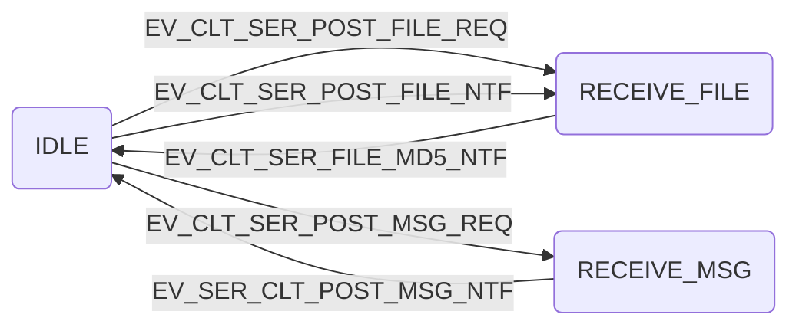
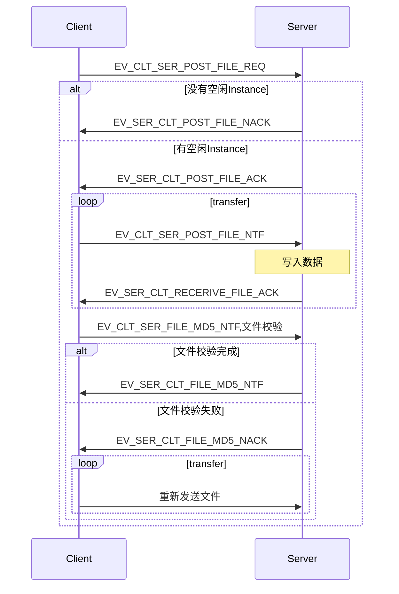
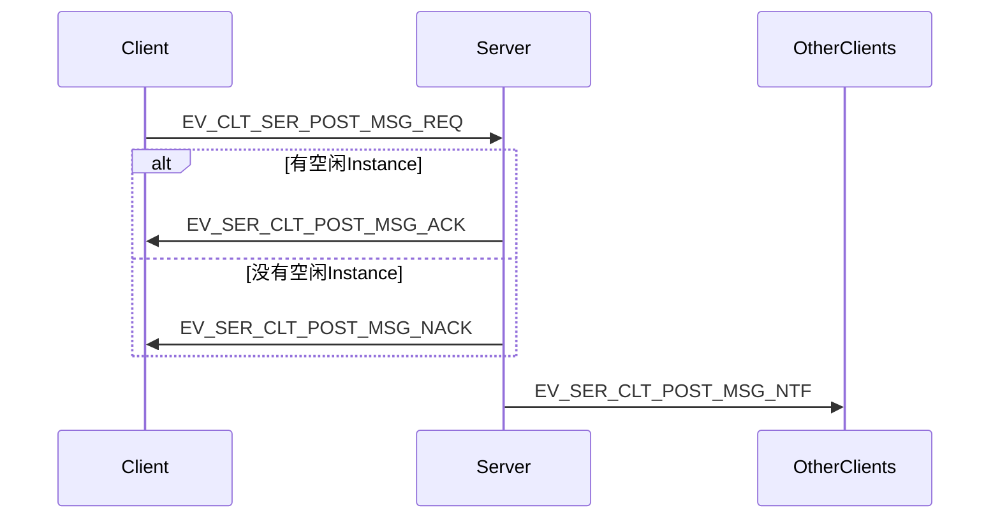
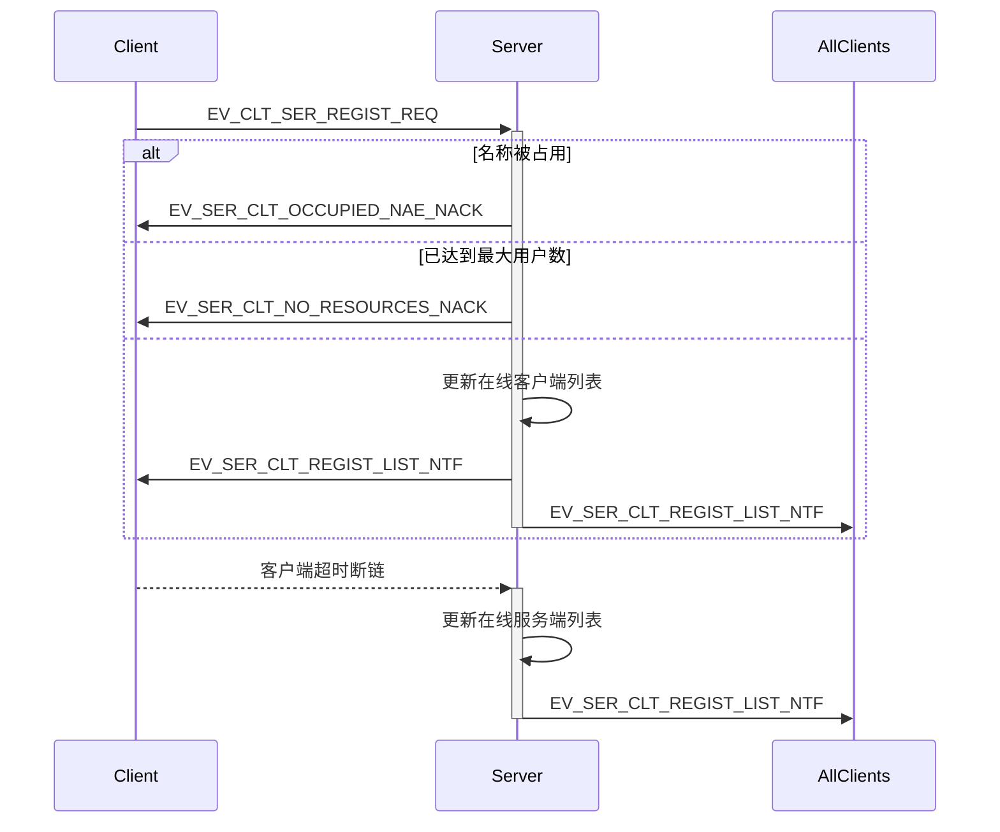
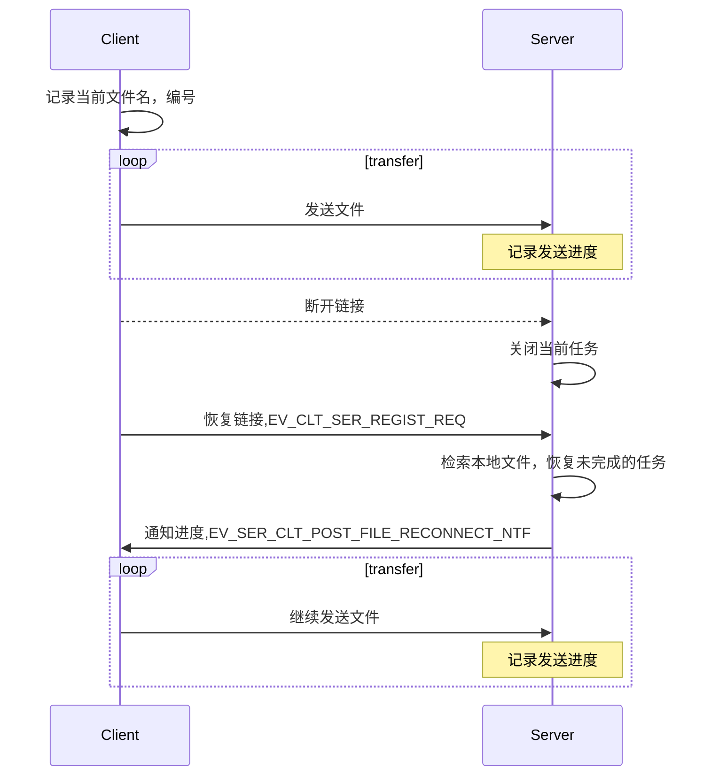
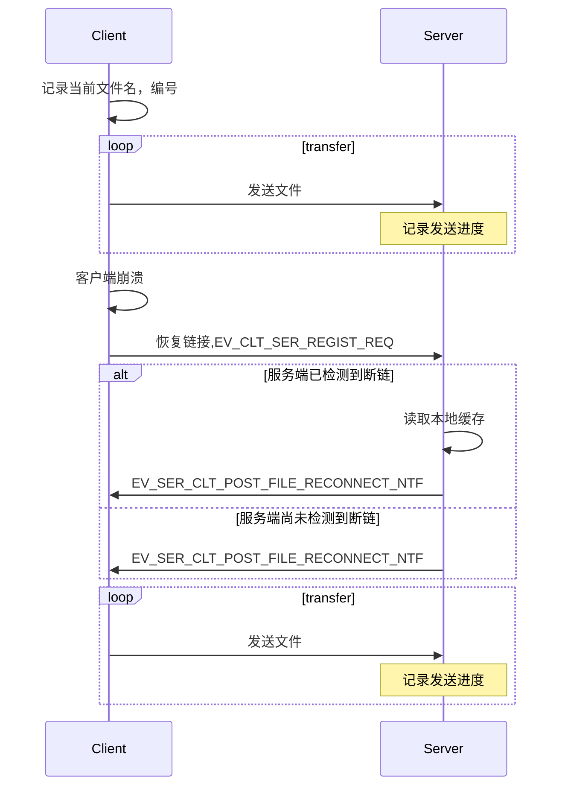
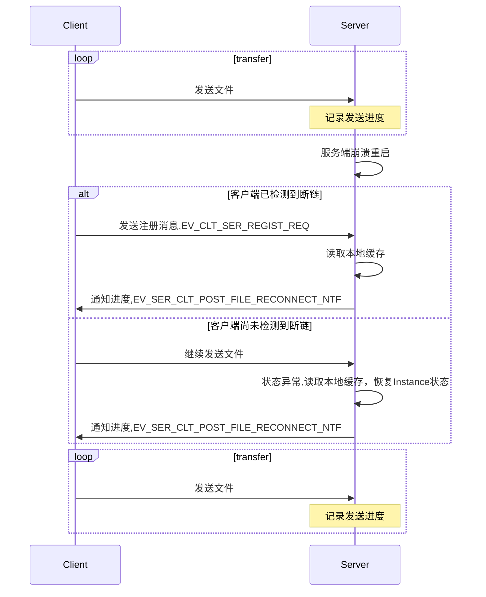

# OspDemo 概要设计 Server
--------

[TOC]

## 需求

* 实现客户端文件上传功能
* 支持客户端同时上传多个文件(最多同时上传5个文件)
* 支持断点续传(客户端程序崩溃重启, 客户端和服务端断链,服务端崩溃重启)
* 上传文件完整性验证
* 定义统一的消息体，可以支持文件和短消息传输
* 支持在线客户端列表的获取和实时刷新(最多支持100个客户端同时在线)
* 支持客户端之间的消息转发(最多16个客户端)

## 设计原则
* 服务端可以在Windows或Linux下编译运行
* 服务端可以同时处理多个客户端的任务


## 服务端Instance状态定义
```C++
#define INSTANCE_STATUS_IDLE             u32(0)    // 空闲
#define INSTANCE_STATUS_RECEIVE_FILE     u32(3)    // 接收文件
#define INSTANCE_STATUS_RECEIVE_MSG      u32(4)    // 接收Message
```

## 客户端Instance状态图


## 文件上传

* Client发送传输文件请求后，服务端分配空闲Instance并返回Instance号，否则拒绝传输
* 服务端对客户端的每一条消息都要确认并回复
* 服务端收到校验码表示当前文件发送完毕，若验证成功则关闭文件，否则要求客户端重传
* 消息体结构：
```C++
#define EV_CLT_SER_POST_FILE_REQ           (u16)1       // 客户端请求传输文件
typedef struct {
	u8 fileNum;                     // 文件数量
	char fileName[FILE_BUF_SIZE];   // 文件名
}clt_ser_post_file_req;

#define EV_SER_CLT_POST_FILE_ACK           (u16)2       // 服务端确认开始接收文件
typedef struct {
	u8 InstanceNo;                  // 分配的Instance号
}ser_clt_post_file_ack;

#define EV_SER_CLT_POST_FILE_NACK          (u16)3       // 服务端拒绝接收文件
#define EV_CLT_SER_POST_FILE_NTF           (u16)4       // 客户端发送文件给服务端
typedef struct {
	u8 fileNo;                      // 文件编号
	s8 fileName[FILE_BUF_SIZE];     // 文件内容
}clt_ser_post_file_ntf;

#define EV_SER_CLT_RECERIVE_FILE_ACK       (u16)5       // 服务端确认接收文件
typedef struct {
	u8 fileNo;                      // 文件编号
}ser_clt_post_receive_file_ack;

#define EV_CLT_SER_FILE_MD5_NTF            (u16)6       // 客户端文件传输完毕，发送md5校验码
typedef struct {
	u8 fileNo;                      // 文件编号
	s16 md5;                        // 文件md5校验码
}clt_ser_file_end_ntf;

#define EV_SER_CLT_FILE_MD5_NTF            (u16)7       // 服务端文件校验完成
#define EV_SER_CLT_FILE_MD5_NACK           (u16)8       // 服务端文件校验失败
```

## 一对多消息发送

* 服务端收到请求后会分配空闲Instance并回复确认，若没有则回复NACK
* 消息体结构：
``` C++
#define EV_CLT_SER_POST_MSG_REQ            (u16)9       // 客户端通知服务端发送消息
typedef struct {
	u8 clientNum;                   // 目标客户端数量
	u32 clientAppID[16];            // 目标客户端节点号
	s8 msgContent[FILE_BUF_SIZE];   // 消息内容
}clt_ser_post_msg_req;

#define EV_SER_CLT_POST_MSG_ACK            (u16)10      // 服务端确认接收消息
#define EV_SER_CLT_POST_MSG_NACK           (u16)11      // 服务端拒绝接收消息

#define EV_SER_CLT_POST_MSG_NTF            (u16)12      // 服务端向客户端发送消息
typedef struct {
	u32 srcNode;                    // 源节点
	s8 msgContent[FILE_BUF_SIZE];   // 消息内容
}ser_clt_post_msg_ntf;

```

## 在线客户端列表的获取和实时刷新

* 客户端发送的注册请求，服务端会确认回复
* 每当有新客户端注册，都会更新本地客户端列表，列表中包含客户端节点号和用户名，然后发给所有客户端
* 消息体结构：
``` C++
#define EV_CLT_SER_REGIST_REQ              (u16)13      // 客户端发送注册请求
typedef struct {
	s8 userName[FILE_BUF_SIZE];     // 用户名
}clt_ser_regist_req;

#define EV_SER_CLT_REGIST_LIST_NTF         (u16)14      // 服务端更新在线客户端列表
typedef struct {
	int clientNum;                  // 在线客户端数量
	u32 clientNode[100];            // 在线客户端节点号
	s8 userName[FILE_BUF_SIZE];     // 在线客户端用户名
}ser_clt_regist_list_ntf;

#define EV_SER_CLT_OCCUPIED_NAE_NACK       (u16)15      // 名称被占用，拒绝注册
#define EV_SER_CLT_NO_RESOURCES_NACK       (u16)16      // 服务端资源不足
```

## 断点续传
### 传输过程中客户端和服务端断链

* 服务端在每次接收数据包后会记录文件名，文件编号及传输进度
* 客户端发送注册请求后会检索本地文件，若有未完成的任务，则恢复任务，并通知客户端进度
* 消息体结构：
``` C++
#define EV_CLT_SER_REGIST_REQ              (u16)13      // 客户端发送注册请求
typedef struct {
	s8 userName[FILE_BUF_SIZE];     // 用户名
}clt_ser_regist_req;

#define EV_SER_CLT_POST_FILE_RECONNECT_NTF (u16)17      // 服务端通知继续发送文件
typedef struct {
	s32 fileProgress[MAX_FILE_NUM]; // 文件传输进度
}ser_clt_post_file_reconnect_ntf;
```

### 传输过程中Client崩溃重启

* 客户端在开始发送文件前会记录文件数据，包括文件名，文件编号
* 客户端发送注册请求后会检索本地文件，若有未完成的任务，则恢复任务，并通知客户端进度
* 若在客户端注册时发现其有正在进行的任务，则说明客户端有过重启，通知客户端继续发送
``` C++
#define EV_CLT_SER_REGIST_REQ              (u16)13      // 客户端发送注册请求
typedef struct {
	s8 userName[FILE_BUF_SIZE];     // 用户名
}clt_ser_regist_req;

#define EV_SER_CLT_POST_FILE_RECONNECT_NTF (u16)17      // 服务端通知继续发送文件
typedef struct {
	s32 fileProgress[MAX_FILE_NUM]; // 文件传输进度
}ser_clt_post_file_reconnect_ntf;
```

### 传输过程中Server崩溃重启

* 客户端在开始发送文件前会记录文件数据，包括文件名，文件编号
* 服务端在每次接收数据包后会记录文件名，文件编号及传输进度
* 客户端检测到断链后，会不断尝试重连
``` C++
#define EV_CLT_SER_REGIST_REQ              (u16)14      // 客户端发送注册请求
typedef struct {
	char userName[FILE_BUF_SIZE];   // 用户名
}clt_ser_regist_req;

#define EV_SER_CLT_POST_FILE_RECONNECT_NTF (u16)17      // 服务端通知继续发送文件
typedef struct {
	s32 fileProgress[MAX_FILE_NUM]; // 文件传输进度
}ser_clt_post_file_reconnect_ntf;
```