# OspDemo 概要设计 Client
--------

[TOC]

## 需求

* 实现客户端文件上传功能
* 支持客户端同时上传多个文件(最多同时上传5个文件)
* 支持文件发送过程中添加新任务
* 支持断点续传(客户端程序崩溃重启, 客户端和服务端断链,服务端崩溃重启)
* 上传文件完整性验证
* 支持客户端之间的消息转发(最多16个客户端)
* 支持离线消息发送
* 支持在线客户端列表的获取和实时刷新(最多支持100个客户端同时在线)

## 设计原则
* 模块化设计、底层作为开发库供UI层调用
* 为避免网络传输中的数据丢失，客户端与服务端之间发送的每一条REQ类型消息都需对方确认，否则超时重传
* 客户端使用两套App，FileApp和MsgApp，FileApp用于处理文件发送任务，MsgApp用于处理消息收发，更新在线客户端列表


## 多文件上传

### Instance状态定义
```C++
#define INSTANCE_STATUS_IDLE             u32(0)    // 空闲
#define INSTANCE_STATUS_POST_FILE        u32(1)    // 发送文件
#define INSTANCE_STATUS_POST_MSG         u32(2)    // 发送消息
```
### 文件状态定义
```C++
enum FILE_STATUS {
    FILE_STATUS_WAITING,   // 等待传输
    FILE_STATUS_SENDING,   // 传输中
    FILE_STATUS_PAUSE,     // 暂停状态
    FILE_STATUS_COMPLETE   // 传输完毕
};
```

### Instance状态图

### 文件状态图
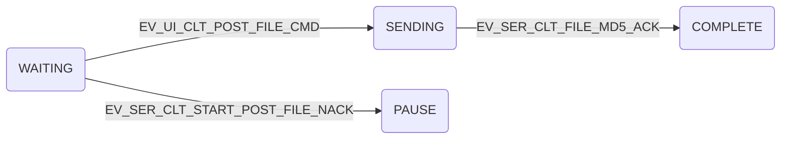
### 时序图
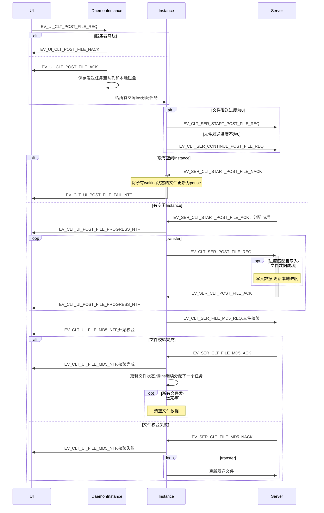
* 客户端设置5个普通Instance，每次最多可同时发送5个文件
* 客户端DaemonIns收到UI端发送请求后，会保存文件信息，初始化文件状态，然后给所有空闲Ins各分配一个文件进行传输
* 客户端Ins发送传输文件请求后，服务端分配空闲Instance并返回Instance号，否则拒绝传输
* 如果对于某一个文件，服务器拒绝传输，则客户端会通知UI并将所有剩余的文件置为暂停状态
* 客户端发送的数据包中包含当前数据包在文件中的位置
* 服务端每次收到文件数据后，会与本地保存的进度进行比较，只有进度匹配才会写入本地文件
* 无论进度是否匹配，服务端都会回复一条确认消息，包含当前已储存的进度
* 客户端与服务端之间相互发送的每一条REQ类型的消息(不包含文件发送)，都需要对方确认，否则超时重传
* 消息定义
```C++
#define EV_UI_CLT_POST_FILE_REQ                  (u16)19      // UI请求开始发送文件
typedef struct {
	u16 fileNum;                    // 文件数量
	s8 fileName[FILE_BUF_SIZE];     // 文件名
}ui_clt_post_file_req;
#define EV_UI_CLT_POST_FILE_ACK                  (u16)19      // 底层开始发送文件
#define EV_UI_CLT_POST_FILE_NACK                 (u16)20      // 底层拒绝发送文件
#define EV_CLT_UI_POST_FILE_PROGRESS_NTF         (u16)21      // 底层通知UI文件进度
typedef struct {
	u16 fileNo;                     // 文件编号
	u32 progress;                   // 文件进度
}ui_clt_post_file_progress_ntf;
#define EV_CLT_UI_POST_FILE_FAIL_NTF             (u16)22      // 底层通知UI服务端资源不足
#define EV_CLT_UI_FILE_MD5_NTF                   (u16)23      // 底层通知UI文件完整性校验
typedef struct {
	enum MD5 {
		MD5_START_VERIFY,
		MD5_VERIFY_COMPLETE,
		MD5_VERIFY_FAILED
	};
	MD5 status;
}clt_ui_file_md5_ntf;

#define EV_CLT_SER_START_POST_FILE_REQ           (u16)1       // 客户端请求传输文件
typedef struct {
	char fileName[FILE_BUF_SIZE];   // 文件名
}clt_ser_post_file_req;
#define EV_SER_CLT_START_POST_FILE_ACK           (u16)2       // 服务端确认开始接收文件
typedef struct {
	u8 InstanceNo;                  // 分配的Instance号
}ser_clt_post_file_ack;
#define EV_SER_CLT_START_POST_FILE_NACK          (u16)3       // 服务端资源不足

#define EV_CLT_SER_POST_FILE_REQ                 (u16)4       // 客户端发送文件给服务端
typedef struct {
    u32 progress;                   // 文件进度
	s8 fileName[FILE_BUF_SIZE];     // 文件内容
}clt_ser_post_file_ntf;
#define EV_SER_CLT_POST_FILE_ACK                 (u16)5       // 服务端确认接收文件数据
typedef struct {
	u32 progress;                   // 文件进度
}ser_clt_post_file_ack;
#define EV_SER_CLT_POST_FILE_NACK                (u16)5       // 服务端拒绝接收文件数据

#define EV_CLT_SER_FILE_MD5_REQ                  (u16)6       // 客户端文件传输完毕，发送md5校验码
typedef struct {
	s16 md5;                        // 文件md5校验码
}clt_ser_file_end_ntf;

#define EV_SER_CLT_FILE_MD5_ACK                  (u16)7       // 服务端文件校验完成
#define EV_SER_CLT_FILE_MD5_NACK                 (u16)8       // 服务端文件校验失败
```

## 发送过程中添加新文件
### Instance状态图

### 文件状态图

### 时序图
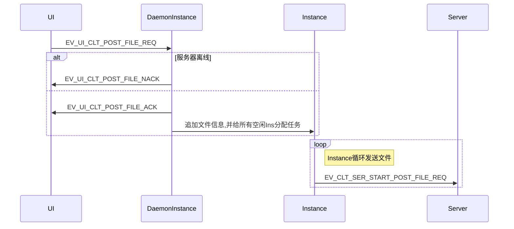

## 暂停发送
### Instance状态图

### 文件状态图
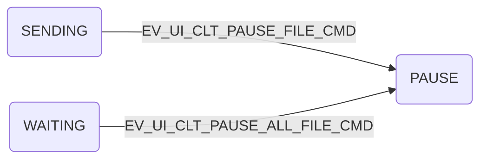
### 时序图
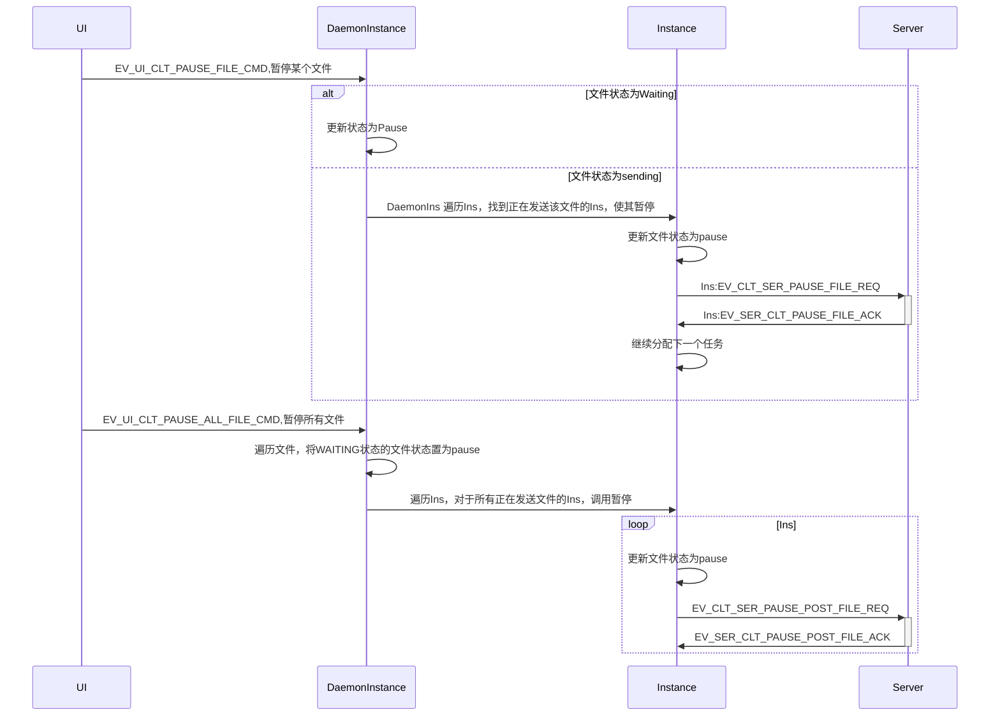
* 消息定义
```C++
#define EV_UI_CLT_PAUSE_FILE_CMD                 (u16)24      // UI通知底层暂停发送
typedef struct {
	u16 fileNo;
}ui_clt_pause_file_cmd;
#define EV_UI_CLT_PAUSE_ALL_FILE_CMD             (u16)25      // UI通知底层全部暂停

#define EV_CLT_SER_PAUSE_FILE_REQ                (u16)9       // 客户端请求暂停
#define EV_SER_CLT_PAUSE_FILE_ACK                (u16)10      // 服务端确认暂停
```

## 继续发送
### Instance状态图

### 文件状态图

### 时序图
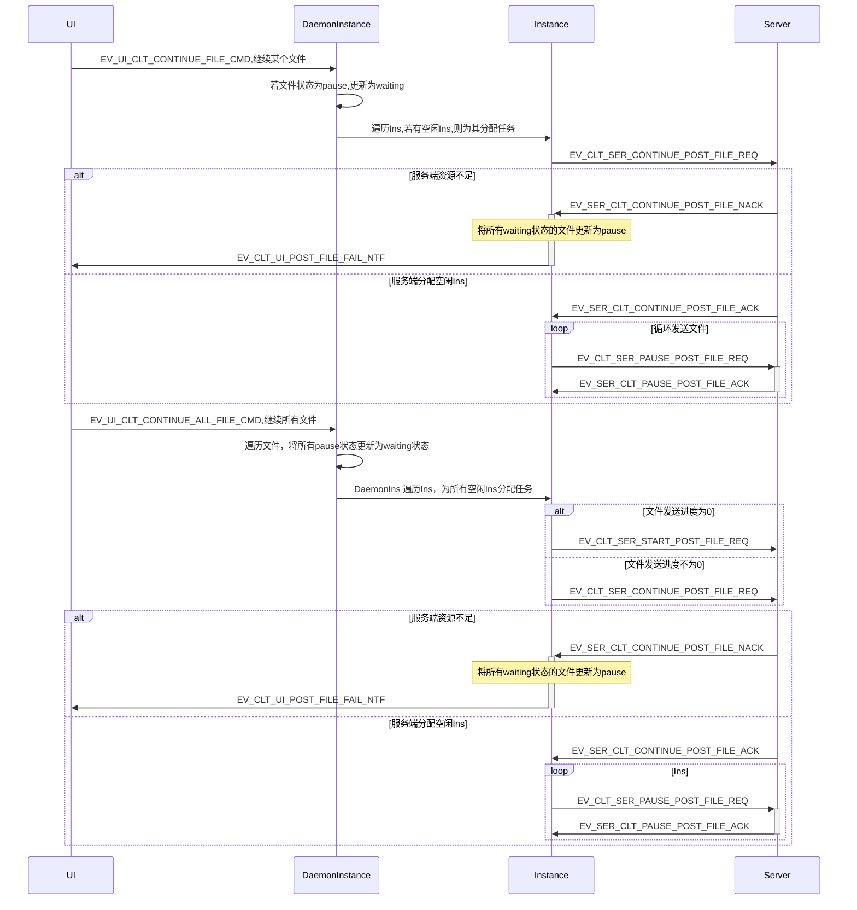
* 消息定义
```C++
#define EV_UI_CLT_CONTINUE_FILE_CMD              (u16)26      // UI通知底层继续发送
typedef struct {
	u16 fileNo;
}ui_clt_pause_file_cmd;
#define EV_UI_CLT_CONTINUE_ALL_FILE_CMD          (u16)27      // UI通知底层全部继续
#define EV_CLT_SER_CONTINUE_POST_FILE_REQ        (u16)11      // 客户端请求继续发送文件
typedef struct {
	char fileName[FILE_BUF_SIZE];   // 文件名
	u32 progress;                   // 文件进度
}clt_ser_continue_post_file_req;
#define EV_SER_CLT_CONTINUE_POST_FILE_ACK        (u16)12      // 服务端确认继续发送文件
typedef struct {
	u8 InstanceNo;                  // 分配的Instance号
	u32 progress;                   // 文件进度
}ser_clt_continue_post_file_ack;
#define EV_SER_CLT_CONTINUE_POST_FILE_NACK       (u16)13      // 服务端拒绝继续发送
```

## 断点续传

### 传输过程中客户端和服务端断链
#### Instance状态图

#### 时序图
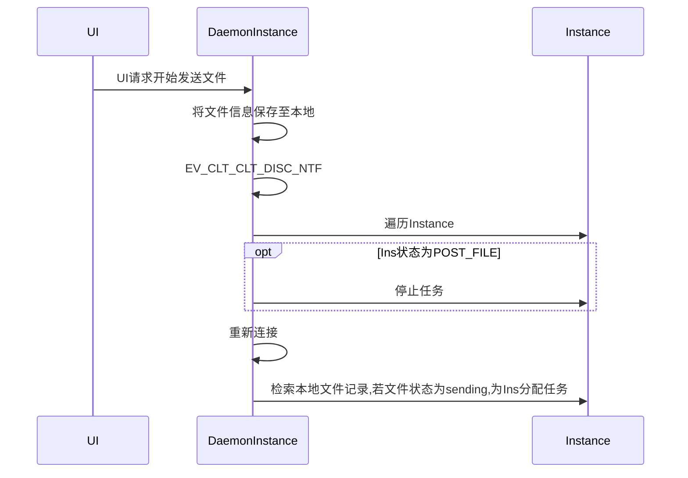
* 底层收到文件发送请求后会在本地保存文件信息，包括文件名，文件编号，发送进度，文件大小，文件状态
* 客户端在每次收到服务端文件进度确认消息后，会记录文件进度到本地
* 断链后，Instance直接停止发送任务，无需其他确认步骤
* 恢复连接后，DaemonInstance会收到重连消息，然后检索本地记录，给sending状态的文件分配Ins继续发送

### 客户端崩溃重启
#### 时序图
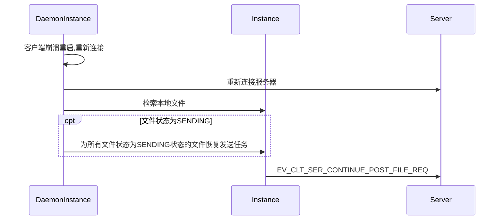
* 底层收到文件发送请求后会在本地保存文件信息，包括文件名，文件编号，发送进度，文件大小，文件状态
* 客户端在每次收到服务端文件进度确认消息后，会记录文件进度到本地
* 客户端重新连接服务端后，会检索本地文件，若有文件状态为发送中，并为其恢复任务

### 服务端崩溃重启
#### 时序图
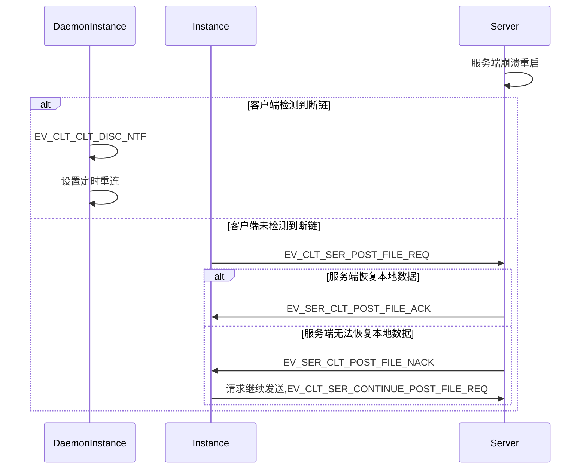

## 在线客户端列表
#### 时序图
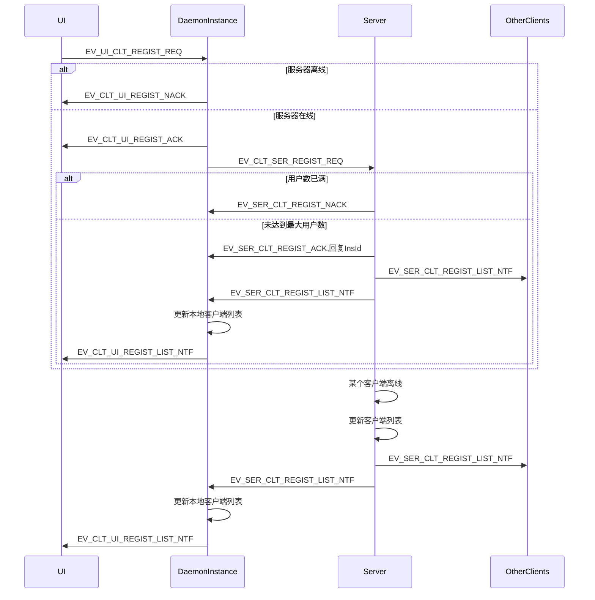
* 客户端建立连接后会发送注册请求
* 服务端收到注册请求后，会分配一个空闲Instance并返回insId
* 消息定义
```C++
#define EV_UI_CLT_REGIST_REQ                     (u16)30      // UI通知底层注册用户名
typedef struct {
	s8 userName[BUFFER_SIZE];       // 用户名
}ui_clt_regist_cmd;
#define EV_CLT_UI_REGIST_ACK                     (u16)31      // 底层确认注册
#define EV_CLT_UI_REGIST_NACK                    (u16)32      // 底层拒绝注册
#define EV_CLT_UI_REGIST_LIST_NTF                (u16)33      // 底层通知UI在线列表
typedef struct {
	s32 clientNum;                  // 客户端数量
	s32 clientNode[100];            // 客户端节点号
	s8 clientName[BUFFER_SIZE];     // 客户端用户名
}clt_ui_regist_list_ntf;

#define EV_CLT_SER_REGIST_REQ                    (u16)17      // 客户端发送注册请求
typedef struct {
	s8 userName[BUFFER_SIZE];     // 用户名
}clt_ser_regist_req;

#define EV_SER_CLT_REGIST_ACK                    (u16)18      // 服务端确认注册
typedef struct {
	s32 insId;                      // 分配的InsId
}ser_clt_regist_ack;
#define EV_SER_CLT_REGIST_NACK                   (u16)19      // 服务端拒绝注册

#define EV_SER_CLT_REGIST_LIST_NTF               (u16)20      // 服务端通知客户端在线列表
typedef struct {
	s32 clientNum;                  // 客户端数量
	s32 clientNode[100];            // 客户端节点号
	s8 clientName[BUFFER_SIZE];     // 客户端用户名
}ser_clt_regist_list_ntf;
```

## 一对多消息发送
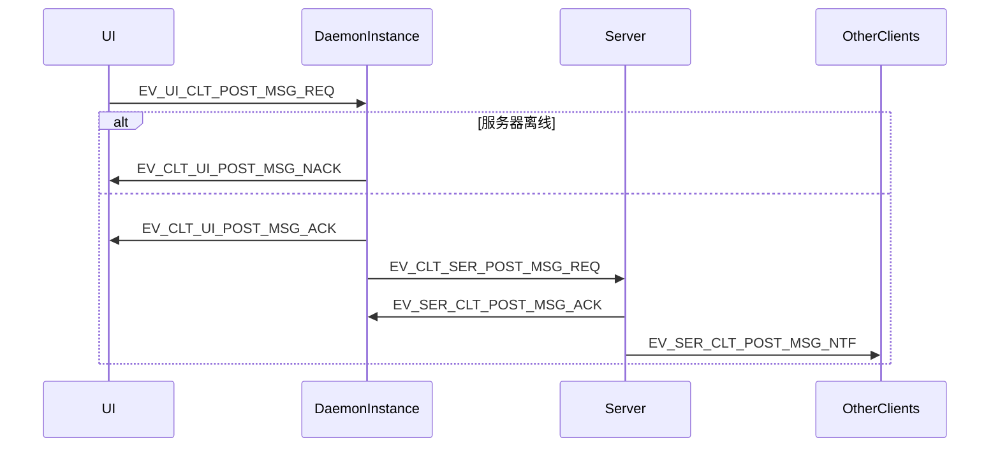
* 客户端发送消息,全部使用服务端中转的方式
* 客户端在注册后会得到服务端分配的insId
* 客户端的消息，都发送给服务端分配的insId处理
* 消息体
```C++
// 发送消息
#define EV_UI_CLT_POST_MSG_REQ                   (u16)35      // UI请求发送消息
typedef struct {
	u16 fileNo;
}ui_clt_post_msg_req;
#define EV_CLT_UI_POST_MSG_ACK                   (u16)36      // 底层确认发送消息
#define EV_CLT_UI_POST_MSG_NACK                  (u16)37      // 底层拒绝发送消息

#define EV_CLT_SER_POST_MSG_REQ                  (u16)18      // 客户端通知服务端发送消息
typedef struct {
	u8 clientNum;                   // 目标客户端数量
	u32 clientAppID[16];            // 目标客户端节点号
	s8 msgContent[BUFFER_SIZE];     // 消息内容
}clt_ser_post_msg_req;
#define EV_SER_CLT_POST_MSG_ACK                  (u16)19      // 服务端确认接收消息
#define EV_SER_CLT_POST_MSG_NACK                 (u16)20      // 服务端拒绝接收消息

#define EV_SER_CLT_POST_MSG_NTF                  (u16)21      // 服务端向客户端发送消息
typedef struct {
	u32 srcNode;                    // 源节点
	s8 msgContent[BUFFER_SIZE];     // 消息内容
}ser_clt_post_msg_ntf;
```