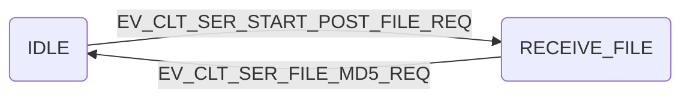
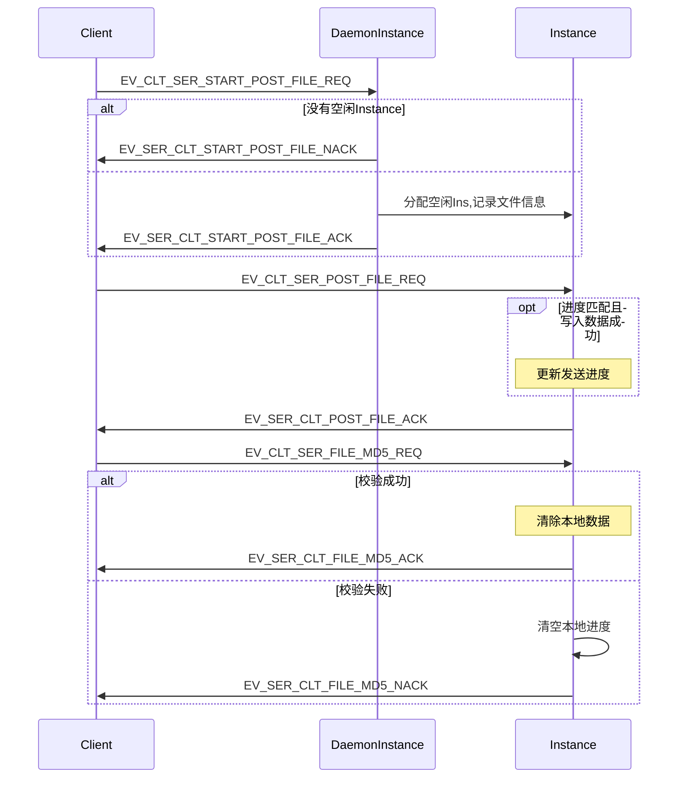
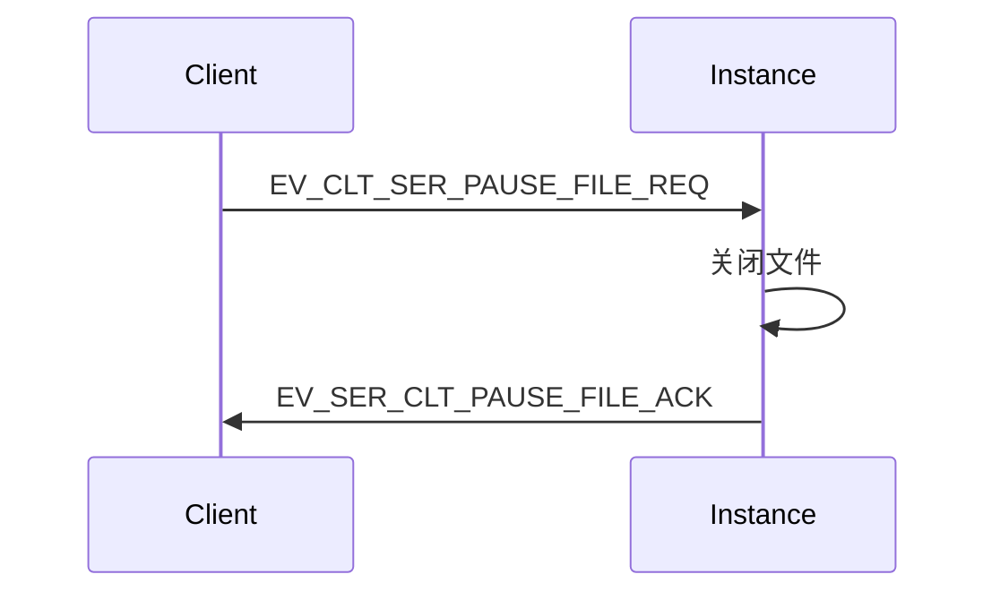
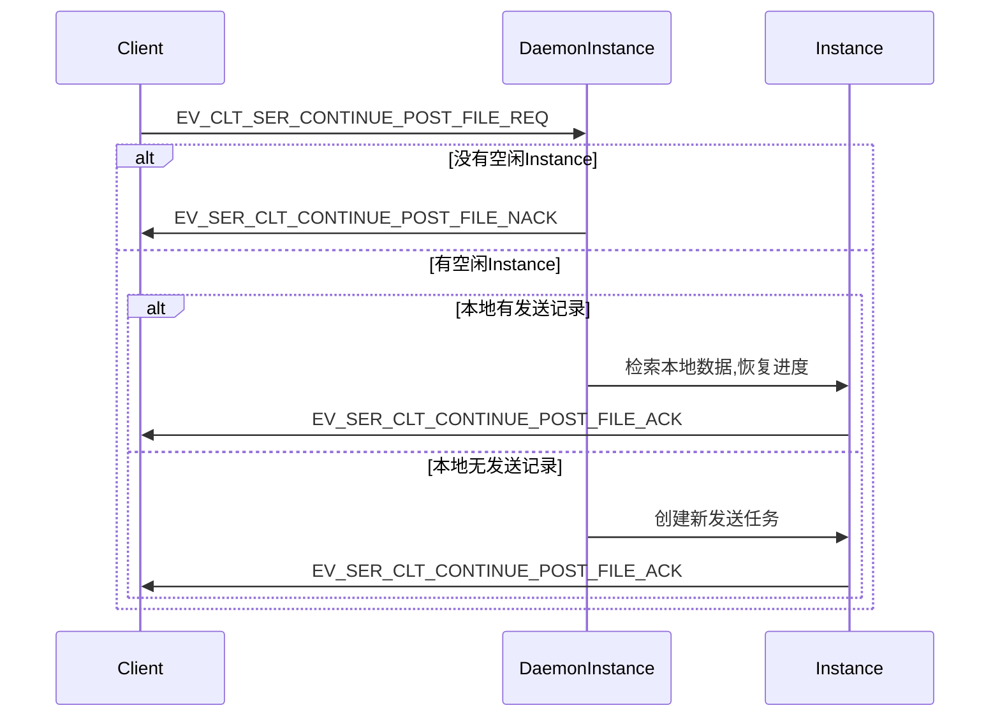
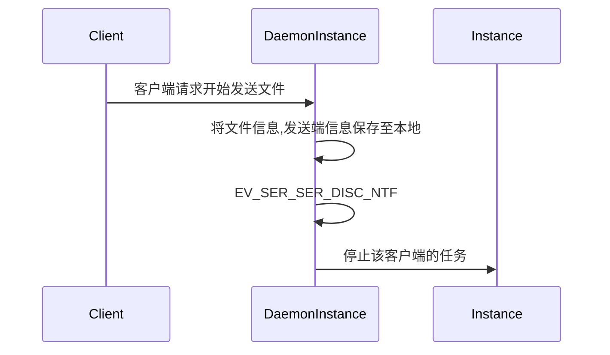
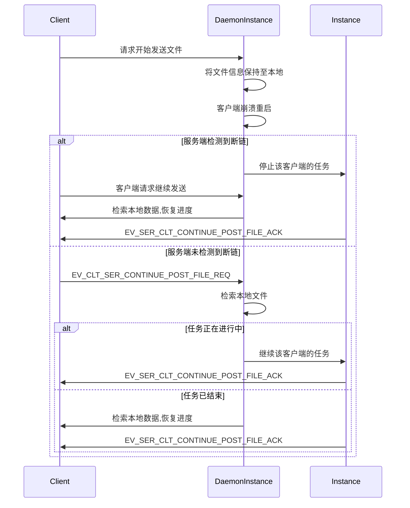
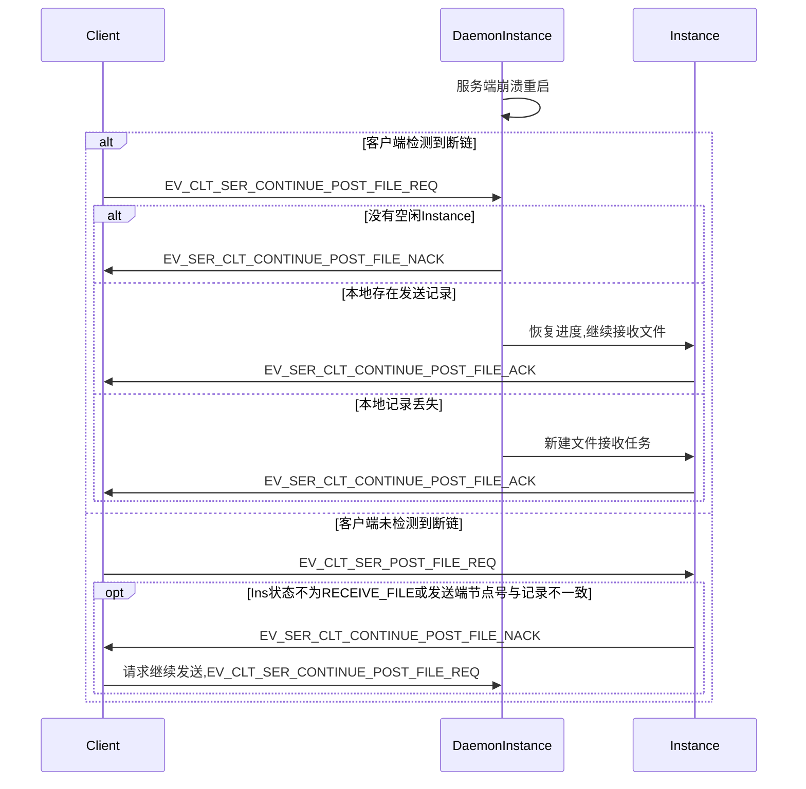
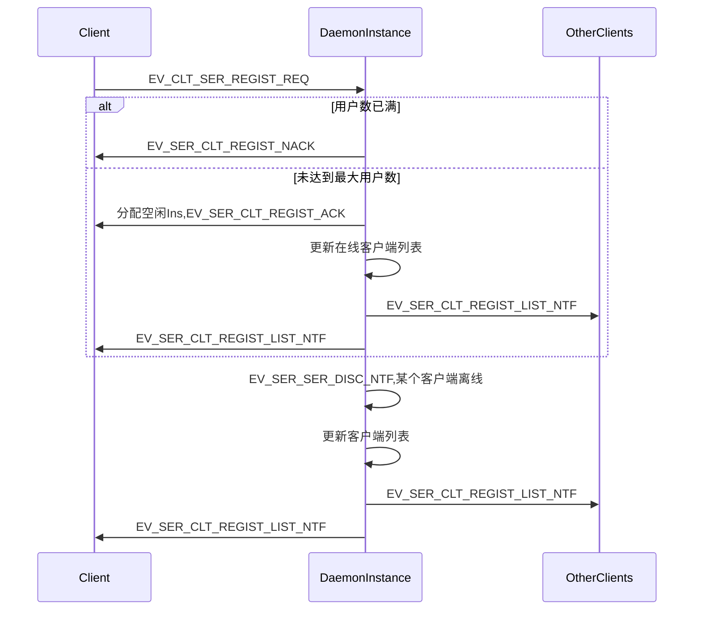
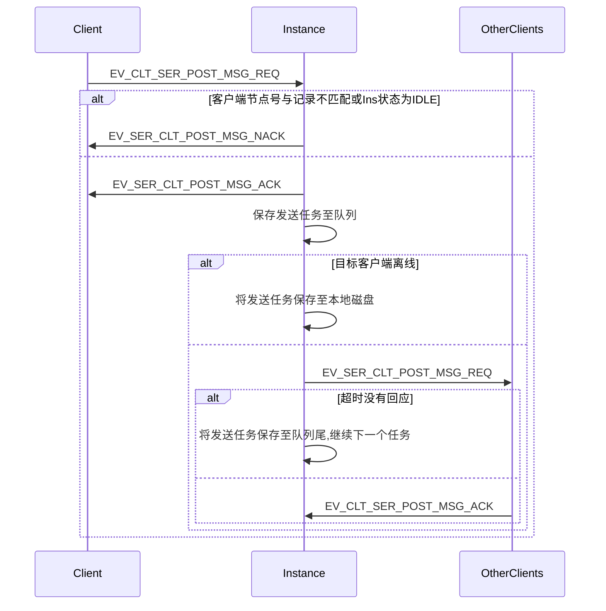
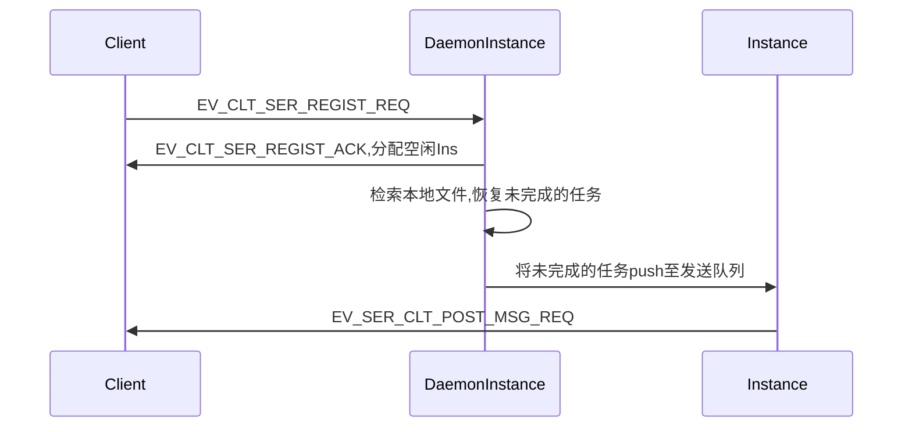

# OspDemo 概要设计 Server
--------

[TOC]

## 需求

* 实现客户端文件上传功能
* 支持客户端同时上传多个文件(最多同时上传5个文件)
* 支持文件发送过程中添加新任务
* 支持断点续传(客户端程序崩溃重启, 客户端和服务端断链,服务端崩溃重启)
* 上传文件完整性验证
* 支持客户端之间的消息转发(最多16个客户端)
* 支持离线消息发送
* 支持在线客户端列表的获取和实时刷新(最多支持100个客户端同时在线)

## 设计原则
* 为避免网络传输中的数据丢失，客户端与服务端之间发送的每一条REQ类型消息都需对方确认，否则超时重传
* 服务端使用两套App，FileApp和MsgApp，FileApp用于处理文件发送任务，MsgApp用于处理消息收发，更新在线客户端列表

## Instance状态定义
```C++
#define INSTANCE_STATUS_IDLE             u32(0)    // 空闲
#define INSTANCE_STATUS_RECEIVE_FILE     u32(1)    // 接收文件
#define INSTANCE_STATUS_RECEIVE_MSG      u32(2)    // 接收文件
```

## 多文件上传
### Instance状态图

### 时序图

* 服务端设置200个普通Instance，每次可以同时处理200个文件发送任务
* 服务端DaemonIns收到文件发送请求后，会保存发送人信息，文件信息
* 消息定义
```C++
#define EV_CLT_SER_START_POST_FILE_REQ           (u16)1       // 客户端请求传输文件
typedef struct {
	char fileName[FILE_BUF_SIZE];   // 文件名
}clt_ser_post_file_req;
#define EV_SER_CLT_START_POST_FILE_ACK           (u16)2       // 服务端确认开始接收文件
typedef struct {
	u8 InstanceNo;                  // 分配的Instance号
}ser_clt_post_file_ack;
#define EV_SER_CLT_START_POST_FILE_NACK          (u16)3       // 服务端资源不足

#define EV_CLT_SER_POST_FILE_REQ                 (u16)4       // 客户端发送文件给服务端
typedef struct {
    u32 progress;                   // 文件进度
	s8 fileName[FILE_BUF_SIZE];     // 文件内容
}clt_ser_post_file_ntf;
#define EV_SER_CLT_POST_FILE_ACK                 (u16)5       // 服务端确认接收文件数据
typedef struct {
	u32 progress;                   // 文件进度
}ser_clt_post_file_ack;
#define EV_SER_CLT_POST_FILE_NACK                (u16)5       // 服务端拒绝接收文件数据

#define EV_CLT_SER_FILE_MD5_REQ                  (u16)6       // 客户端文件传输完毕，发送md5校验码
typedef struct {
	s16 md5;                        // 文件md5校验码
}clt_ser_file_end_ntf;

#define EV_SER_CLT_FILE_MD5_ACK                  (u16)7       // 服务端文件校验完成
#define EV_SER_CLT_FILE_MD5_NACK                 (u16)8       // 服务端文件校验失败
```

## 暂停发送
### Instance状态图

### 时序图

* 消息定义
```C++
#define EV_CLT_SER_PAUSE_FILE_REQ                (u16)9       // 客户端请求暂停
#define EV_SER_CLT_PAUSE_FILE_ACK                (u16)10      // 服务端确认暂停
```

## 继续发送
### Instance状态图

### 时序图

* 消息定义
```C++
#define EV_CLT_SER_CONTINUE_POST_FILE_REQ        (u16)11      // 客户端请求继续发送文件
typedef struct {
	char fileName[FILE_BUF_SIZE];   // 文件名
	u32 progress;                   // 文件进度
}clt_ser_continue_post_file_req;
#define EV_SER_CLT_CONTINUE_POST_FILE_ACK        (u16)12      // 服务端确认继续发送文件
typedef struct {
	u8 InstanceNo;                  // 分配的Instance号
	u32 progress;                   // 文件进度
}ser_clt_continue_post_file_ack;
#define EV_SER_CLT_CONTINUE_POST_FILE_NACK       (u16)13      // 服务端拒绝继续发送
```

## 断点续传

### 传输过程中客户端和服务端断链
#### Instance状态图

#### 时序图

* 服务端收到文件发送请求后会在本地保存文件信息和发送端信息，包括文件名，发送进度，文件大小，发送端用户名和分配的Instance编号
* 服务端在每次收到文件数据后，会将文件进度记录到本地
* 某个文件发送完毕后，服务端会清除本地发送记录
* 断链后，DaemonInstance通知Instance直接停止接收任务，无需其他确认步骤

### 客户端崩溃重启
#### 时序图

* 服务端收到文件发送请求后会在本地保存文件信息和发送端信息，包括文件名，发送进度，文件大小，发送端用户名节点号和分配的Instance编号
* 服务端在每次收到文件数据后，会将文件进度记录到本地
* 某个文件发送完毕后，服务端会清除本地发送记录

### 服务端崩溃重启
#### 时序图


## 在线客户端列表
### Instance状态图


### 时序图

* 客户端建立连接后会发送注册请求
* 服务端收到注册请求后，会分配一个空闲Instance并返回insId，该Ins会保存客户端节点号，专门处理该客户端的数据
* 消息定义
```C++
#define EV_CLT_SER_REGIST_REQ                    (u16)17      // 客户端发送注册请求
typedef struct {
	s8 userName[BUFFER_SIZE];     // 用户名
}clt_ser_regist_req;

#define EV_SER_CLT_REGIST_ACK                    (u16)18      // 服务端确认注册
typedef struct {
	s32 insId;                      // 分配的InsId
}ser_clt_regist_ack;
#define EV_SER_CLT_REGIST_NACK                   (u16)19      // 服务端拒绝注册

#define EV_SER_CLT_REGIST_LIST_NTF               (u16)20      // 服务端通知客户端在线列表
typedef struct {
	s32 clientNum;                  // 客户端数量
	s32 clientNode[100];            // 客户端节点号
	s8 clientName[BUFFER_SIZE];     // 客户端用户名
}ser_clt_regist_list_ntf;
```

## 一对多消息发送

* 客户端发送消息,全部使用服务端中转的方式
* 客户端在注册后会得到服务端分配的insId
* 客户端的消息，都发送给服务端分配的insId处理
* 服务端会将发送任务push到消息队列中，然后对队列中的消息逐条处理
* 消息体
```C++
// 发送消息
#define EV_CLT_SER_POST_MSG_REQ                  (u16)18      // 客户端通知服务端发送消息
typedef struct {
	u8 clientNum;                   // 目标客户端数量
	u32 clientAppID[16];            // 目标客户端节点号
	s8 msgContent[BUFFER_SIZE];     // 消息内容
}clt_ser_post_msg_req;
#define EV_SER_CLT_POST_MSG_ACK                  (u16)19      // 服务端确认接收消息
#define EV_SER_CLT_POST_MSG_NACK                 (u16)20      // 服务端拒绝接收消息

#define EV_SER_CLT_POST_MSG_NTF                  (u16)21      // 服务端向客户端发送消息
typedef struct {
	u32 srcNode;                    // 源节点
	s8 msgContent[BUFFER_SIZE];     // 消息内容
}ser_clt_post_msg_ntf;
```

## 离线消息发送

* 服务端收到发送请求后会将发送任务保存至本地队列
* 若目标客户端离线，服务端会将发送任务保存到本地磁盘
* 目标客户端重新发送注册请求，服务端会分配空闲Instance并回复InstanceID
* 目标客户端注册后，服务端会检索本地文件，并用分配的Instance恢复未完成的发送任务

